# MyDocker

## URLs

GitHub: https://github.com/chance2021/dk-devops-review-quiz

Attendance: https://docs.google.com/spreadsheets/d/1ycnDY6OF1UFTYxSq2lWlQo0y-g6Ozko1KRAQysBQOPg/edit#gid=0

## Weeks

### Week 5 : 20211104

<details>
  <summary>Click to expand!</summary>

Form

https://docs.google.com/forms/d/e/1FAIpQLSe7askqcK5IQcE8ejKbBlCL7LkDAY_4N3QVm1uJJTfea1J-SQ/viewform?usp=sf_link

```shell
#!/bin/bash

docker pull nginx:1.20
docker pull redis:alpine3.14
docker pull hello-world
docker pull ubuntu
docker run -d --name indoc -p 8080:80 -p 8081:80 nginx:1.20 &
docker run -d --name dk -p 8082:6379 redis:alpine3.14  &
clear
echo "Please wait 10s for the environment setup..."
sleep 10s
echo ""
echo ""
echo "The test environment is ready! Please go to the quiz to start your test! Good luck!"
echo "Note: The quiz link should be sent to your email. Please contact Chance if you don't receive it. Thanks"
```

</details>

### Week 6 : 20211111

<details>
  <summary>Click to expand!</summary>

https://docs.google.com/forms/d/e/1FAIpQLSfwYtUy4sRGcKCLtSniodfM3Epka4leQu3LDv9K1Fg-OFLjQw/viewscore?viewscore=AE0zAgDjCpW4PNJUMEn6ShcOq5DK3d_gXGKiks5hPbCToXVuCWLZ4ExXYvY4DahB5eMyhOw

```shell
$ pwd
/root/dk-devops-review-quiz/week6-20211111
$ cat setup.sh
#!/bin/bash

docker pull nginx
docker pull redis
docker pull hello-world
docker pull ubuntu
docker run -d --name dk -p 8888:80 -v /usr/local/share:/tmp nginx &
docker run -d --name indoc -p 9999:6379 -p 7777:6378 redis &
clear
echo "Please wait 10s for the environment setup..."
sleep 10s
echo ""
echo ""
echo "The test environment is ready! Please go to the quiz to start your test! Good luck!"
echo "Note: The quiz link should be sent to your email. Please contact Chance if you don't receive it. Thanks"
```


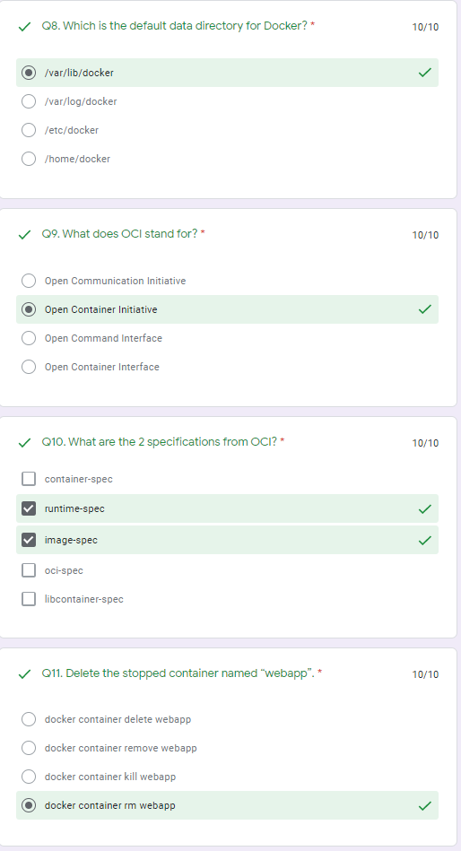

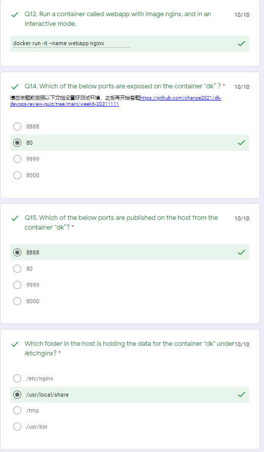

</details>

### Week 7 : 20211118

<details>
  <summary>Click to expand!</summary>

https://docs.google.com/forms/d/e/1FAIpQLSdp8j9vBE0ah8Gt4sEUVKp67VwOEhVGCZTcI3Eq4WNxAzioVw/viewform?vc=0&c=0&w=1&flr=0

https://docs.google.com/forms/d/e/1FAIpQLSdp8j9vBE0ah8Gt4sEUVKp67VwOEhVGCZTcI3Eq4WNxAzioVw/viewscore?viewscore=AE0zAgAldjB2mYgCnKPUulcYS81cd0sdoeipA9keGTTZixQ8zo0RIbW-95pQwtZg__M0ly8

```dos
$ pwd
/root/dk-devops-review-quiz/week6-20211111
$ cat setup.sh
#!/bin/bash

docker pull nginx
docker pull redis
docker pull hello-world
docker pull ubuntu
echo "This is week7!" > /usr/local/share/hello.txt
docker run -d --name dk -p 8888:80 -v /usr/local/share:/tmp nginx &
docker run -d --name indoc -p 9999:6379 -p 7777:6378 redis &

clear
echo "Please wait 5s for the environment setup..."
sleep 5s
echo ""
echo ""
echo "The test environment is ready! Please go to the quiz to start your test! Good luck!"
echo "Note: The quiz link should be sent to your email. Please contact Chance if you don't receive it. Thanks"
```


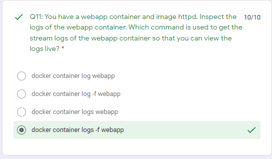

```dos
docker start dk
docker exec -it dk cat /tmp/hello.txt
```

</details>

### Week 8 : 20211125

<details>
  <summary>Click to expand!</summary>

https://docs.google.com/forms/d/e/1FAIpQLSe0L8OxeNb1R1080r6U2rVLhNnYNFHI2l-6IGIKNnEhEvsxoQ/viewform?vc=0&c=0&w=1&flr=0

```dos
$ docker container run --help | grep name
      --domainname string              Container NIS domain name
  -h, --hostname string                Container host name
      --name string                    Assign a name to the container
      --pid string                     PID namespace to use
  -u, --user string                    Username or UID (format: <name|uid>[:<group|gid>])
      --userns string                  User namespace to use
      --uts string                     UTS namespace to use
$ docker container run -d --name nginx --hostname=webapp nginx
07408e9f51de83aff9bc6db7db661be2bc9939339c9e3a1fca264a35858df405
```

- no Do not automatically restart the container. (the default)
- on-failure[:max-retries] Restart the container if it exits due to an error, which manifests as a non-zero exit code. Optionally, limit the number of times the Docker daemon - attempts to restart the container using the :max-retries option.
- always Always restart the container if it stops. If it is manually stopped, it is restarted only when Docker daemon restarts or the container itself is manually restarted. (See - the second bullet listed in restart policy details)
- unless-stopped Similar to always, except that when the container is stopped (manually or otherwise), it is not restarted even after Docker daemon restarts.

```dos
$ docker container inspect dk | grep restart
$ docker container inspect dk | grep RestartPolicy
            "RestartPolicy": {
```

```dos
            "RestartPolicy": {
                "Name": "no",
                "MaximumRetryCount": 0
            },
```

The live restore option helps reduce container downtime due to daemon crashes, planned outages, or upgrades.

There are two ways to enable the live restore setting to keep containers alive when the daemon becomes unavailable. Only do one of the following.

- Add the configuration to the daemon configuration file. On Linux, this defaults to /etc/docker/daemon.json. On Docker Desktop for Mac or Docker Desktop for Windows, select the Docker icon from the task bar, then click Preferences -> Daemon -> Advanced.

  Use the following JSON to enable live-restore.

  ```json
  {
    "live-restore": true
  }
  ```

- Restart the Docker daemon. On Linux, you can avoid a restart (and avoid any downtime for your containers) by reloading the Docker daemon. If you use systemd, then use the command systemctl reload docker. Otherwise, send a SIGHUP signal to the dockerd process.

You can copy files out and then back into a container (even when the container is stopped):

```dos
docker cp $container_name:/path/in/container /path/on/host
```

```dos
docker cp /path/on/host $container_name:/path/in/container
```

```dos
-p 8080:80
Map TCP port 80 in the container to port 8080 on the Docker host.
```

Firewall iptables rules

Use -h option to display size in power of 1024 df -h /home/m

Use -H option to display sizes in power of 1000 df -H /home/m

```dos
$ df
Filesystem     1K-blocks    Used Available Use% Mounted on
udev              745936       0    745936   0% /dev
tmpfs             153172     712    152460   1% /run
/dev/vda1      247794676 8006136 227178236   4% /
tmpfs             765848       0    765848   0% /dev/shm
tmpfs               5120       0      5120   0% /run/lock
tmpfs             765848       0    765848   0% /sys/fs/cgroup
tmpfs             153172       0    153172   0% /run/user/0
overlay        247794676 8006136 227178236   4% /var/lib/docker/overlay/e200940260fed90eb832c4008e6ddf89f4a2dd03570953cea9771414c3cbeee7/merged
overlay        247794676 8006136 227178236   4% /var/lib/docker/overlay/1228229eda137029993387c037298199189cf3163ed4d8dae04a3fcdfcc03237/merged
overlay        247794676 8006136 227178236   4% /var/lib/docker/overlay/427f1061d256696cc5f8c4826face155d72b0b60f5bed486fcf229bd204c5955/merged
$ df -h
Filesystem      Size  Used Avail Use% Mounted on
udev            729M     0  729M   0% /dev
tmpfs           150M  712K  149M   1% /run
/dev/vda1       237G  7.7G  217G   4% /
tmpfs           748M     0  748M   0% /dev/shm
tmpfs           5.0M     0  5.0M   0% /run/lock
tmpfs           748M     0  748M   0% /sys/fs/cgroup
tmpfs           150M     0  150M   0% /run/user/0
overlay         237G  7.7G  217G   4% /var/lib/docker/overlay/e200940260fed90eb832c4008e6ddf89f4a2dd03570953cea9771414c3cbeee7/merged
overlay         237G  7.7G  217G   4% /var/lib/docker/overlay/1228229eda137029993387c037298199189cf3163ed4d8dae04a3fcdfcc03237/merged
overlay         237G  7.7G  217G   4% /var/lib/docker/overlay/427f1061d256696cc5f8c4826face155d72b0b60f5bed486fcf229bd204c5955/merged
$ df -H
Filesystem      Size  Used Avail Use% Mounted on
udev            764M     0  764M   0% /dev
tmpfs           157M  730k  157M   1% /run
/dev/vda1       254G  8.2G  233G   4% /
tmpfs           785M     0  785M   0% /dev/shm
tmpfs           5.3M     0  5.3M   0% /run/lock
tmpfs           785M     0  785M   0% /sys/fs/cgroup
tmpfs           157M     0  157M   0% /run/user/0
overlay         254G  8.2G  233G   4% /var/lib/docker/overlay/e200940260fed90eb832c4008e6ddf89f4a2dd03570953cea9771414c3cbeee7/merged
overlay         254G  8.2G  233G   4% /var/lib/docker/overlay/1228229eda137029993387c037298199189cf3163ed4d8dae04a3fcdfcc03237/merged
overlay         254G  8.2G  233G   4% /var/lib/docker/overlay/427f1061d256696cc5f8c4826face155d72b0b60f5bed486fcf229bd204c5955/merged
```

```dos
$ docker cp dk:/tmp/hello.txt /home
$ ls /home
hello.txt  packer
```

```dos
$ docker exec dk cat /tmp/hello.txt
This is week7!
$ docker exec -it dk echo "This is week9 now" >> /tmp/hello.txt
$ docker exec dk cat /tmp/hello.txt
This is week7!

$ cat /home/hello.txt
This is week7!
$ echo "This is week9 now" >> /home/hello.txt
$ cat /home/hello.txt
This is week7!
This is week9 now

$ docker cp /home/hello.txt dk:/tmp/hello.txt
$ docker exec dk cat /tmp/hello.txt
This is week7!
This is week9 now
```

```dos
docker exec dk bash -c "echo 'This is week9 now' >> /tmp/hello.txt "
docker container exec dk bash -c "echo 'This is week9 now' >> /tmp/hello.txt "
```

-c string If the -c option is present, then commands are read from string.

If there are arguments after the string, they are assigned to the positional parameters, starting with $0.

-v ~/nginxlogs:/var/log/nginx

sets up a bindmount volume that links the /var/log/nginx directory from inside the Nginx container to the ~/nginxlogs directory on the host machine.

Docker uses a : to split the host's path from the container path, and the host path always comes first.

```dos
docker run --name week9 -d -p 8080:80 -v /usr/local/share:/tmp nginx
docker container run --name week9 -d -p 8080:80 -v /usr/local/share:/tmp nginx
```

https://docs.google.com/forms/d/e/1FAIpQLSe0L8OxeNb1R1080r6U2rVLhNnYNFHI2l-6IGIKNnEhEvsxoQ/viewscore?viewscore=AE0zAgAqSi-YcDX_HF_XLDWThAInmx-IvD9HT9YMe4O2ba70Jv4Kc0tsv4bwO0adDMCfcc0

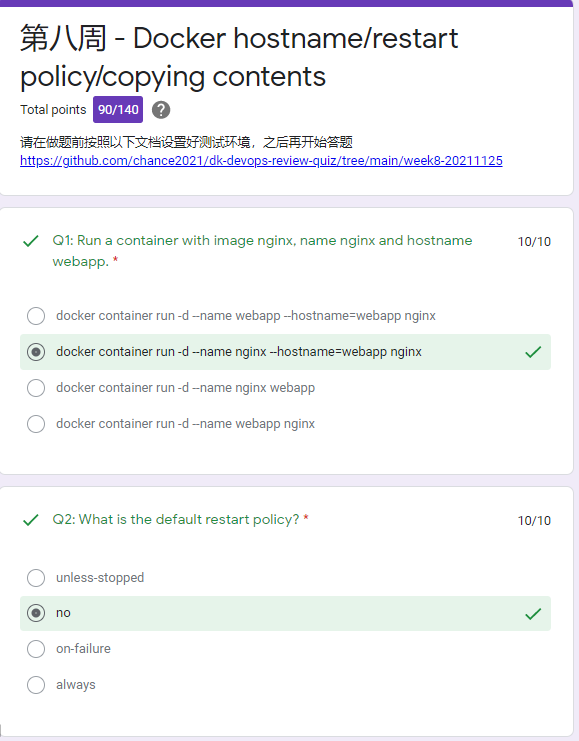


</details>

### Week 9 : 20211202

<details>
  <summary>Click to expand!</summary>

To configure the Docker daemon using a JSON file, create a file at /etc/docker/daemon.json on Linux systems, or C:\ProgramData\docker\config\daemon.json on Windows. On MacOS go to the whale in the taskbar > Preferences > Daemon > Advanced.

Here's what the configuration file looks like:

```
{
  "debug": true,
  "tls": true,
  "tlscert": "/var/docker/server.pem",
  "tlskey": "/var/docker/serverkey.pem",
  "hosts": ["tcp://192.168.59.3:2376"]
}
```

As a default, Docker uses the json-file logging driver, which caches container logs as JSON internally.

The following example starts an Alpine container with the none logging driver.

```dos
docker run -it --log-driver none alpine ash
```

Docker installs two custom iptables chains named DOCKER-USER and DOCKER , and it ensures that incoming packets are always checked by these two chains first.

A private Docker registry allows you to share your custom base images within your organization, keeping a consistent, private, and centralized source of truth for the building blocks of your architecture.

Docker Hub is Docker's official cloud-based registry for Docker images. As you might expect, since Docker Hub is Docker's official registry, it is the default registry when you install Docker.

In reality, latest is used as the default tag when you haven't specified anything else.

Manage images

```dos
docker image
```

```dos
docker image COMMAND
```

List images

```dos
docker image ls
```

The default docker images will show all top level images, their repository and tags, and their size.

List the most recently created images

```dos
docker images
```

List images by name and tag -

```dos
docker images <string>
```

List all images in the "ls" repository

```dos
docker images ls
```

List the full length image IDs

```dos
$ docker images --no-trunc
REPOSITORY                 TAG                 IMAGE ID                                                                  CREATED             SIZE
redis                      latest              sha256:aea9b698d7d1d2fb22fe74868e27e767334b2cc629a8c6f9db8cc1747ba299fd   5 days ago          113MB
nginx                      latest              sha256:f652ca386ed135a4cbe356333e08ef0816f81b2ac8d0619af01e2b256837ed3e   6 days ago          141MB
ubuntu                     latest              sha256:ba6acccedd2923aee4c2acc6a23780b14ed4b8a5fa4e14e252a23b846df9b6c1   7 weeks ago         72.8MB
hello-world                latest              sha256:feb5d9fea6a5e9606aa995e879d862b825965ba48de054caab5ef356dc6b3412   2 months ago        13.3kB
mariadb                    10                  sha256:1b3986d60f138825865a5c22e19d877f0318d60e88383a0e2fb8baa05bd5a461   13 months ago       414MB
mariadb                    latest              sha256:1b3986d60f138825865a5c22e19d877f0318d60e88383a0e2fb8baa05bd5a461   13 months ago       414MB
redis                      <none>              sha256:62f1d3402b787aebcd74aaca5df9d5fe5e8fe4c0706d148a963c70d74a497e51   13 months ago       104MB
ubuntu                     <none>              sha256:d70eaf7277eada08fca944de400e7e4dd97b1262c06ed2b1011500caa4decaf1   13 months ago       72.9MB
mysql                      8                   sha256:db2b37ec6181ee1f367363432f841bf3819d4a9f61d26e42ac16e5bd7ff2ec18   13 months ago       545MB
mysql                      latest              sha256:db2b37ec6181ee1f367363432f841bf3819d4a9f61d26e42ac16e5bd7ff2ec18   13 months ago       545MB
alpine                     latest              sha256:d6e46aa2470df1d32034c6707c8041158b652f38d2a9ae3d7ad7e7532d22ebe0   13 months ago       5.57MB
postgres                   12                  sha256:492fb9ae4e7af4e4aa4169afd0cc8738034f0abd313f231f5f607c067fff4654   14 months ago       314MB
postgres                   latest              sha256:c96f8b6bc0d9f0277f118cf485a8c302e32cfe05e7d65f6e9a4c106679439d5e   14 months ago       314MB
mongo                      latest              sha256:ba0c2ff8d3620c0910832424efef02787214013b1c5b1d9dc9d87d638e2ceb71   14 months ago       492MB
weaveworks/scope           1.11.4              sha256:a082d48f0b3958355182fca79028d369312c10dee0390f1b163b54d9db3e2c33   2 years ago         78.5MB
quay.io/ansible/molecule   2.20                sha256:1171569d6ba4123db651b42a1b28f9735089384f3742977b5f493fe9134cc49a   2 years ago         704MB
```

stars

This example displays images with a name containing ‘busybox' and at least 3 stars:

```dos
$ docker search --filter stars=3 busybox
NAME                    DESCRIPTION                                     STARS               OFFICIAL            AUTOMATED
busybox                 Busybox base image.                             2415                [OK]
progrium/busybox                                                        70                                      [OK]
radial/busyboxplus      Full-chain, Internet enabled, busybox made f…   43                                      [OK]
yauritux/busybox-curl   Busybox with CURL                               16
arm32v7/busybox         Busybox base image.                             10
armhf/busybox           Busybox base image.                             6
odise/busybox-curl                                                      4                                       [OK]
arm64v8/busybox         Busybox base image.                             3
arm32v6/busybox         Busybox base image.                             3
aarch64/busybox         Busybox base image.                             3
```

```dos
$ docker image ls
REPOSITORY                 TAG                 IMAGE ID            CREATED             SIZE
redis                      latest              aea9b698d7d1        5 days ago          113MB
nginx                      latest              f652ca386ed1        6 days ago          141MB
$ docker image tag redis:latest redis:v1
$ docker image ls
REPOSITORY                 TAG                 IMAGE ID            CREATED             SIZE
redis                      latest              aea9b698d7d1        5 days ago          113MB
redis                      v1                  aea9b698d7d1        5 days ago          113MB
nginx                      latest              f652ca386ed1        6 days ago          141MB
```

Show docker disk usage

```dos
docker system df
```

```dos
$ docker system df
TYPE                TOTAL               ACTIVE              SIZE                RECLAIMABLE
Images              14                  3                   2.971GB             2.842GB (95%)
Containers          3                   2                   1.095kB             0B (0%)
Local Volumes       2                   2                   92B                 0B (0%)
Build Cache         0                   0                   0B                  0B
```

Run a command in a new container

```dos
docker run [OPTIONS] IMAGE [COMMAND] [ARG...]
```

```
--interactive , -i Keep STDIN open even if not attached
--tty , -t Allocate a pseudo-TTY
--name Assign a name to the container
--publish , -p Publish a container's port(s) to the host
--volume , -v Bind mount a volume
```

-p host-port:container-port

-v /host/folder:/container/directory

docker run -it --name apps -p 8088:80 -v /usr/local/:/tmp nginx:1.21.4

https://docs.google.com/forms/d/e/1FAIpQLSdxpyYUfiz7yNgU4gwOSEajESuOQuNqJIuVm0bBjwqoX04meg/viewform?vc=0&c=0&w=1&flr=0

https://docs.google.com/forms/d/e/1FAIpQLSdxpyYUfiz7yNgU4gwOSEajESuOQuNqJIuVm0bBjwqoX04meg/viewscore?viewscore=AE0zAgB97izg5ZY7H1u753KZ8mWHh7Yl0m7-X7PEVOLL5_M3-bUW9LQ-wC4sU23IQwZHw_Y


</details>

### Week 10 : 20211209

<details>
  <summary>Click to expand!</summary>

https://docs.google.com/forms/d/e/1FAIpQLSf784OyJslWcL79G32QRMgofJeyWotnwwDwuOv1l7spLAnHyA/viewform?vc=0&c=0&w=1&flr=0

https://docs.google.com/forms/d/e/1FAIpQLSf784OyJslWcL79G32QRMgofJeyWotnwwDwuOv1l7spLAnHyA/viewscore?viewscore=AE0zAgBT8mUD5F5D1NLRajiF_PvO_LlenlKqD9B5dpE_i2S3N1bXeFhqPlSRBo64lYsTHH0

```dos
$ docker run --name apps -p 8088:80 -v /usr/local:/tmp -d nginx:1.21.4
d81d274f95793d882898054c034c56f4ac7766e2b30702404be0e5e865baab20
```

```dos
$ docker exec dk bash -c "echo 'This is week11 now' > /tmp/week11.txt"
$ docker exec dk bash -c "cat /tmp/week11.txt"
This is week11 now
```

docker commit

Create a new image from a container's changes

```dos
docker commit [OPTIONS] CONTAINER [REPOSITORY[:TAG]]
```

```dos
$ docker ps
CONTAINER ID        IMAGE               COMMAND                  CREATED             STATUS              PORTS                                            NAMES
5029c0a6807a        nginx               "/docker-entrypoint.…"   11 minutes ago      Up 11 minutes       0.0.0.0:8888->80/tcp                             dk
10ea70f0bee9        redis               "docker-entrypoint.s…"   11 minutes ago      Up 11 minutes       0.0.0.0:7777->6378/tcp, 0.0.0.0:9999->6379/tcp   indoc
$ docker container commit dk mynginx
sha256:46f828c0d24c877a5e39f54a534d0facf7a1be407bc6e75db1393341851826bc
$ docker ps
CONTAINER ID        IMAGE               COMMAND                  CREATED             STATUS              PORTS                                            NAMES
5029c0a6807a        nginx               "/docker-entrypoint.…"   12 minutes ago      Up 12 minutes       0.0.0.0:8888->80/tcp                             dk
10ea70f0bee9        redis               "docker-entrypoint.s…"   12 minutes ago      Up 12 minutes       0.0.0.0:7777->6378/tcp, 0.0.0.0:9999->6379/tcp   indoc
```

docker export

Export a container's filesystem as a tar archive

```dos
 docker export [OPTIONS] CONTAINER
```

```dos
$ docker image list
REPOSITORY                 TAG                 IMAGE ID            CREATED             SIZE
mynginx                    latest              46f828c0d24c        10 minutes ago      141MB
redis                      latest              aea9b698d7d1        12 days ago         113MB
$ docker image save mynginx -o mynginx.tar
$
```

By default, Docker will use /var/lib/docker/tmp for it's temporary directory. This can be overridden with the DOCKER_TMP environment variable for the docker daemon.

Git URLs accept context configuration in their fragment section, separated by a colon (:). The first part represents the reference that Git will check out, and can be either a branch, a tag, or a remote reference. The second part represents a subdirectory inside the repository that will be used as a build context.

For example, run this command to use a directory called docker in the branch container:

```
 docker build https://github.com/docker/rootfs.git#container:docker
```


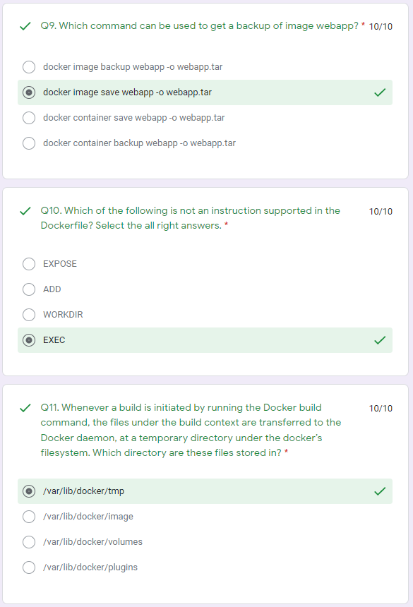


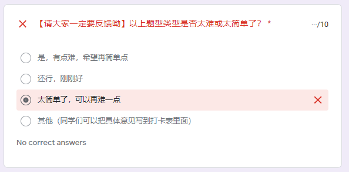

</details>

### Week 11 : 20211216

<details>
  <summary>Click to expand!</summary>

COPY takes in a src and destination. It only lets you copy in a local or directory from your host (the machine-building the Docker image) into the Docker image itself.

COPY <src> <dest>

ADD lets you do that too, but it also supports 2 other sources. First, you can use a URL instead of a local file/directory. Secondly, you can extract tar from the source directory into the destination.

ADD <src> <dest>

In most cases, if you're using a URL, you download a zip file and then use the RUN command to extract it. However, you might as well just use RUN and curl instead of ADD here, so you chain everything into 1 RUN command to make a smaller Docker image.

The CMD command we saw earlier followed the Shell syntax:

CMD executable parameter1 parameter2

However, it is better practice to use the JSON array format:

CMD ["executable", "parameter1", "parameter2"]

The ENTRYPOINT or CMD that you specify in your Dockerfile identify the default executable for your image. However, the user has the option to override either of these values at run time.

The default ENTRYPOINT can be similarly overridden but it requires the use of the --entrypoint flag:

$ docker run --entrypoint hostname demo
075a2fa95ab7

You can achieve this same thing with CMD, but the use of ENTRYPOINT sends a strong message that this container is only intended to run this one command.

Combining ENTRYPOINT and CMD allows you to specify the default executable for your image while also providing default arguments to that executable which may be overridden by the user. Let's look at an example:

```
FROM ubuntu:trusty
ENTRYPOINT ["/bin/ping","-c","3"]
CMD ["localhost"]
```

```
$ docker build -t ping .
...

$ docker run ping
PING localhost (127.0.0.1) 56(84) bytes of data.
64 bytes from localhost (127.0.0.1): icmp_seq=1 ttl=64 time=0.025 ms
64 bytes from localhost (127.0.0.1): icmp_seq=2 ttl=64 time=0.038 ms
64 bytes from localhost (127.0.0.1): icmp_seq=3 ttl=64 time=0.051 ms

--- localhost ping statistics ---
3 packets transmitted, 3 received, 0% packet loss, time 1999ms
rtt min/avg/max/mdev = 0.025/0.038/0.051/0.010 ms

$ docker ps -l
CONTAINER ID IMAGE COMMAND CREATED
82df66a2a9f1 ping:latest "/bin/ping -c 3 localhost" 6 seconds ago
```

When both an ENTRYPOINT and CMD are specified, the CMD string(s) will be appended to the ENTRYPOINT in order to generate the container's command string. Remember that the CMD value can be easily overridden by supplying one or more arguments to `docker run` after the name of the image. In this case we could direct our ping to a different host by doing something like this:

```
$ docker run ping docker.io
PING docker.io (162.242.195.84) 56(84) bytes of data.
64 bytes from 162.242.195.84: icmp_seq=1 ttl=61 time=76.7 ms
64 bytes from 162.242.195.84: icmp_seq=2 ttl=61 time=81.5 ms
64 bytes from 162.242.195.84: icmp_seq=3 ttl=61 time=77.8 ms

--- docker.io ping statistics ---
3 packets transmitted, 3 received, 0% packet loss, time 2003ms
rtt min/avg/max/mdev = 76.722/78.695/81.533/2.057 ms

$ docker ps -l --no-trunc
CONTAINER ID IMAGE COMMAND CREATED
0d739d5ea4e5 ping:latest "/bin/ping -c 3 docker.io" 51 seconds ago
```

Advantages of Multi-Stage Builds

Multi-stage builds let you create complex build routines with a single Dockerfile.

With multi-stage builds, our entire build system can be contained in a single file. You don't need any wrapper scripts to take your project from raw codebase to final application image.

```
$ docker image --help

Usage:  docker image COMMAND

Manage images

Commands:
  build       Build an image from a Dockerfile
  history     Show the history of an image
  import      Import the contents from a tarball to create a filesystem image
  inspect     Display detailed information on one or more images
  load        Load an image from a tar archive or STDIN
  ls          List images
  prune       Remove unused images
  pull        Pull an image or a repository from a registry
  push        Push an image or a repository to a registry
  rm          Remove one or more images
  save        Save one or more images to a tar archive (streamed to STDOUT by default)
  tag         Create a tag TARGET_IMAGE that refers to SOURCE_IMAGE
```

docker export is used to export the container's file system into a tar file. it doesn't export any volumes associated with it.

// export it to a tar file
docker export <containerid> ubuntulatest.tar

docker export --output="ubuntulat.tar" <containerid>

docker save is used to save one or more images into a tar file.

// save both images into tar file
docker save buysbox ubuntu > twoimages.tar

save and export are both used for sharing tar files. But, save is used for images and can save multiple images into a tar file with all the layers and history. export is used for containers without any history or layers.

docker import is used with tarballs which are exported and docker load is used with tarballs which are saved with save command.

```dos
$ docker images
REPOSITORY                 TAG                 IMAGE ID            CREATED             SIZE
redis                      latest              7614ae9453d1        27 hours ago        113MB
nginx                      latest              f6987c8d6ed5        37 hours ago        141MB
ubuntu                     latest              ba6acccedd29        2 months ago        72.8MB
$ docker image save ubuntu -o u.tar
$
$ docker ps
CONTAINER ID        IMAGE               COMMAND                  CREATED             STATUS              PORTS                                            NAMES
299d6c01f56b        nginx               "/docker-entrypoint.…"   9 minutes ago       Up 9 minutes        0.0.0.0:8888->80/tcp                             dk
f01773523671        redis               "docker-entrypoint.s…"   9 minutes ago       Up 9 minutes        0.0.0.0:7777->6378/tcp, 0.0.0.0:9999->6379/tcp   indoc
$ docker export 29 > n.tar
$ ls -l
total 825288
drwxr-xr-x 10 root root      4096 Dec 22 15:56 dk-devops-review-quiz
-rw-------  1 root root 550619648 Dec 22 15:56 mysql.tar
-rw-r--r--  1 root root 144015360 Dec 22 16:06 n.tar
-rw-------  1 root root 150448128 Dec 22 16:05 u.tar
```

Dockefiel ADD

If <src> is a local tar archive in a recognized compression format (identity, gzip, bzip2 or xz) then it is unpacked as a directory.

Resources from remote URLs are not decompressed.

The ADD directive will unpack the .gz automatically on build.

FROM nginx:stable
COPY ~/dk-devops-review-quiz/week11-20211216/index.html /usr/share/nginx/html/

docker build -t week11:v1.0 .

docker run -p 80:80 -d week11:v1.0

https://docs.google.com/forms/d/e/1FAIpQLSe0warzcMkioQQjWCaDVC8bqtyorTEzSj7vsAZkNVMyAlRfhA/viewform?vc=0&c=0&w=1&flr=0

https://docs.google.com/forms/d/e/1FAIpQLSe0warzcMkioQQjWCaDVC8bqtyorTEzSj7vsAZkNVMyAlRfhA/viewscore?viewscore=AE0zAgB-t7_VLPYa9q91tpcaPuQSg-klKfBgkeafskgFXa4AObpEpv7_V0obU3Pcfxu29qk

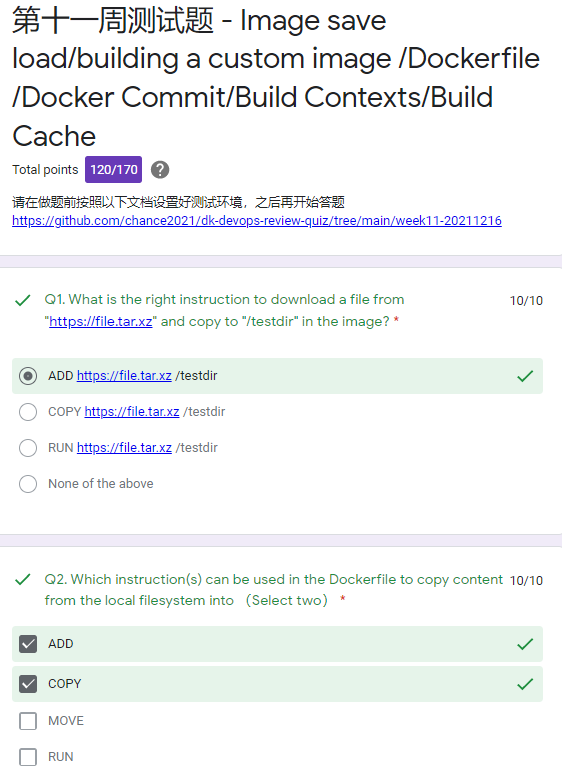

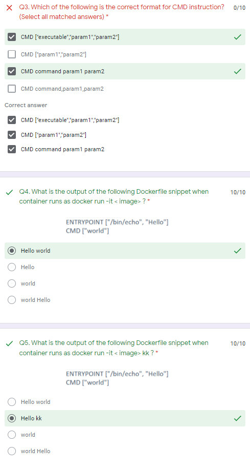

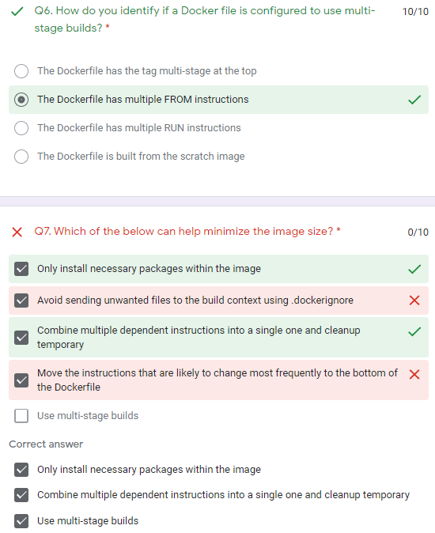

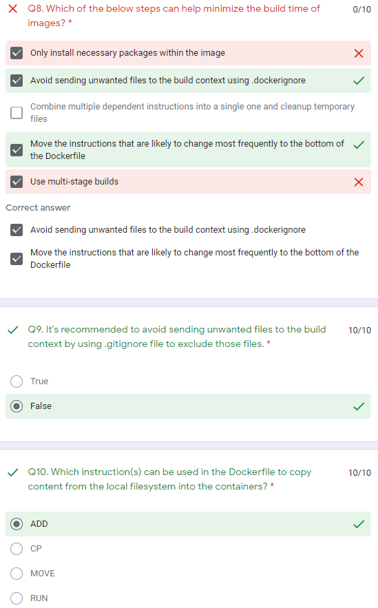

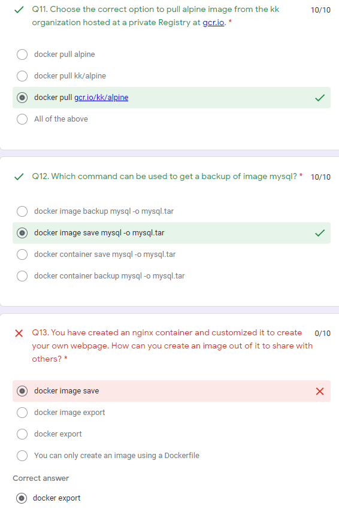

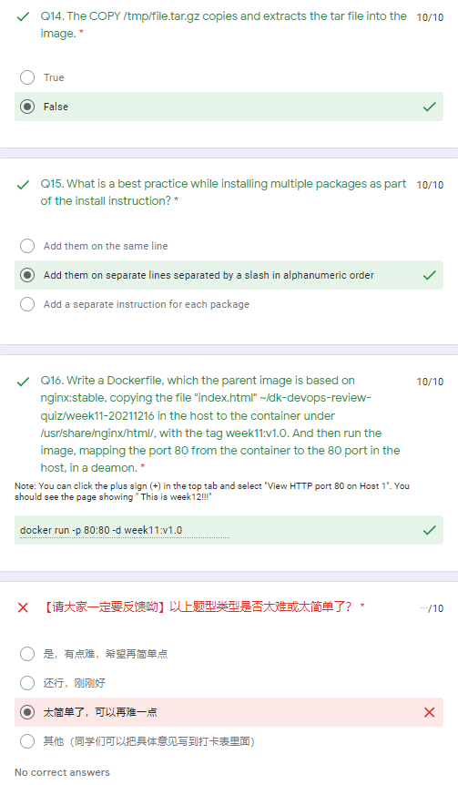

</details>

### Week 12 : 20211223

<details>
  <summary>Click to expand!</summary>

By default, a container has no resource constraints and can use as much of a given resource as the host’s kernel scheduler allows.

--memory-swap is a modifier flag that only has meaning if --memory is also set. Using swap allows the container to write excess memory requirements to disk when the container has exhausted all the RAM that is available to it. There is a performance penalty for applications that swap memory to disk often.

If --memory-swap is explicitly set to -1, the container is allowed to use unlimited swap, up to the amount available on the host system.

By default, each container's access to the host machine's CPU cycles is unlimited.

Every new container will have 1024 shares of CPU by default. However, this value is shown as 0 if running the command mentioned in the audit section. Alternatively, 1.

--cpu-shares

Set this flag to a value greater or less than the default of 1024 to increase or reduce the container’s weight, and give it access to a greater or lesser proportion of the host machine’s CPU cycles. This is only enforced when CPU cycles are constrained. When plenty of CPU cycles are available, all containers use as much CPU as they need. In that way, this is a soft limit. --cpu-shares does not prevent containers from being scheduled in swarm mode. It prioritizes container CPU resources for the available CPU cycles. It does not guarantee or reserve any specific CPU access.

docker run --name week12 -d -p 8080:80 -v /usr/local/share:/tmp nginx:stable

docker container run --name week12 -d -p 8080:80 -v /usr/local/share:/tmp nginx:stable

https://docs.google.com/forms/d/e/1FAIpQLSfNUkAdXaer49CZMzS5EZw2XcAeqdvNxV2mbLqCFCiin5oG4g/viewform?vc=0&c=0&w=1&flr=0

https://docs.google.com/forms/d/e/1FAIpQLSfNUkAdXaer49CZMzS5EZw2XcAeqdvNxV2mbLqCFCiin5oG4g/viewscore?viewscore=AE0zAgC0e-Oq_eVE6pY25WRgGUWwhZSRE2FhjaekCCKaN2kXlrnZM4zC6NZ1XBH-JFk7zIs

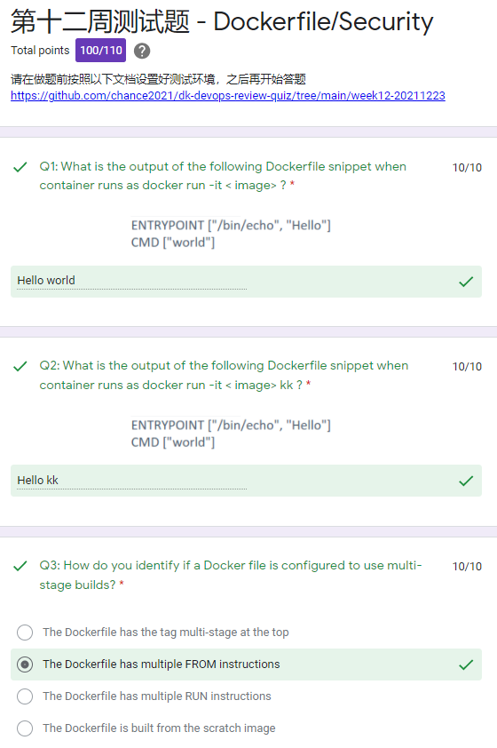


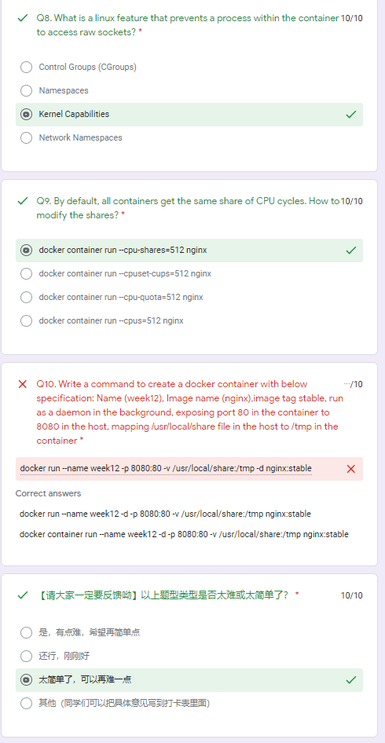

</details>

### Week 13 : 20211230 : Docker Networking

<details>
  <summary>Click to expand!</summary>

#### Lab 1

1.1

```dos
docker container run -itd --name=first centos:7
docker container run -itd --name=second centos:7
docker exec -it first ping second
docker exec -it second ping second
```

```dos
$ docker ps
CONTAINER ID        IMAGE               COMMAND                  CREATED             STATUS              PORTS                                            NAMES
fd669e9a0592        centos:7            "/bin/bash"              4 seconds ago       Up 3 seconds                                                         second
28fe481a67fd        centos:7            "/bin/bash"              12 seconds ago      Up 12 seconds                                                        first
4496ccef680b        nginx               "/docker-entrypoint.…"   4 minutes ago       Up 4 minutes        0.0.0.0:8888->80/tcp                             dk
adbd7c925cfb        redis               "docker-entrypoint.s…"   4 minutes ago       Up 4 minutes        0.0.0.0:7777->6378/tcp, 0.0.0.0:9999->6379/tcp   indoc
$ docker exec -it first ping second
ping: second: Name or service not known
$ docker exec -it second ping second
ping: second: Name or service not known
```

1.2

```dos
docker network create --driver=bridge --subnet=192.168.10.0/24 dknet
```

1.3

```dos
docker container run -itd --name=customfirst --net=dknet centos:7
docker container run -itd --name=customsecond --net=dknet centos:7
docker exec -it customfirst ping customsecond
$ docker exec -it customfirst cat /etc/resolv.conf
nameserver 127.0.0.11
```

```dos
$ docker ps
CONTAINER ID        IMAGE               COMMAND                  CREATED             STATUS              PORTS                                            NAMES
d83d63e87408        centos:7            "/bin/bash"              15 seconds ago      Up 13 seconds                                                        customsecond
1bc15a0cd046        centos:7            "/bin/bash"              36 seconds ago      Up 34 seconds                                                        customfirst
fd669e9a0592        centos:7            "/bin/bash"              3 minutes ago       Up 3 minutes                                                         second
28fe481a67fd        centos:7            "/bin/bash"              3 minutes ago       Up 3 minutes                                                         first
4496ccef680b        nginx               "/docker-entrypoint.…"   7 minutes ago       Up 7 minutes        0.0.0.0:8888->80/tcp                             dk
adbd7c925cfb        redis               "docker-entrypoint.s…"   7 minutes ago       Up 7 minutes        0.0.0.0:7777->6378/tcp, 0.0.0.0:9999->6379/tcp   indoc
$ docker exec -it customfirst ping customsecond
PING customsecond (192.168.10.3) 56(84) bytes of data.
64 bytes from customsecond.dknet (192.168.10.3): icmp_seq=1 ttl=64 time=0.102 ms
64 bytes from customsecond.dknet (192.168.10.3): icmp_seq=2 ttl=64 time=0.085 ms
64 bytes from customsecond.dknet (192.168.10.3): icmp_seq=3 ttl=64 time=0.166 ms
^C
--- customsecond ping statistics ---
8 packets transmitted, 8 received, 0% packet loss, time 6999ms
rtt min/avg/max/mdev = 0.085/0.114/0.166/0.029 ms
$ docker exec -it customfirst cat /etc/resolv.conf
nameserver 127.0.0.11
options ndots:0
```

1.4

```dos
docker exec first ping second
docker network connect dknet first
docker network connect dknet second
docker exec -it first ping second
docker network disconnect dknet first
```

```dos
$ docker exec first ping second
ping: second: Name or service not known
$ docker network connect dknet first
$ docker network connect dknet second
$ docker exec -it first ping second
PING second (192.168.10.5) 56(84) bytes of data.
64 bytes from second.dknet (192.168.10.5): icmp_seq=1 ttl=64 time=0.138 ms
64 bytes from second.dknet (192.168.10.5): icmp_seq=2 ttl=64 time=0.091 ms
64 bytes from second.dknet (192.168.10.5): icmp_seq=3 ttl=64 time=0.081 ms
^C
--- second ping statistics ---
4 packets transmitted, 4 received, 0% packet loss, time 2998ms
rtt min/avg/max/mdev = 0.081/0.105/0.138/0.022 ms
$ docker network disconnect dknet first
$
```

1.5

```dos
docker network inspect dknet
docker network rm dknet
docker network prune
```

#### Lab 2

2.1

```dos
ip netns add red
ip netns add blue
ip netns

ip netns exec red ip link
ip netns exec blue ip link
or
ip -n red link
ip -n blue link

ip netns exec red arp
ip netns exec blud arp
```

```dos
$ ip netns
blue
red
$ ip netns exec red ip link
1: lo: <LOOPBACK> mtu 65536 qdisc noop state DOWN mode DEFAULT group default qlen 1
    link/loopback 00:00:00:00:00:00 brd 00:00:00:00:00:00
$ ip netns exec blue ip link
1: lo: <LOOPBACK> mtu 65536 qdisc noop state DOWN mode DEFAULT group default qlen 1
    link/loopback 00:00:00:00:00:00 brd 00:00:00:00:00:00
$
$ ip -n red link
1: lo: <LOOPBACK> mtu 65536 qdisc noop state DOWN mode DEFAULT group default qlen 1
    link/loopback 00:00:00:00:00:00 brd 00:00:00:00:00:00
$ ip -n blue link
1: lo: <LOOPBACK> mtu 65536 qdisc noop state DOWN mode DEFAULT group default qlen 1
    link/loopback 00:00:00:00:00:00 brd 00:00:00:00:00:00
```

2.2

```dos
ip link add veth-red type veth peer name veth-blue
ip link set veth-red netns red
ip link set veth-blue netns blue
ip netns exec red ip addr
ip netns exec blue ip addr
```

```dos
$ ip netns exec red ip addr
1: lo: <LOOPBACK> mtu 65536 qdisc noop state DOWN group default qlen 1
    link/loopback 00:00:00:00:00:00 brd 00:00:00:00:00:00
22: veth-red@if21: <BROADCAST,MULTICAST> mtu 1500 qdisc noop state DOWN group default qlen 1000
    link/ether 6a:ef:77:87:75:dc brd ff:ff:ff:ff:ff:ff link-netnsid 1
$ ip netns exec blue ip addr
1: lo: <LOOPBACK> mtu 65536 qdisc noop state DOWN group default qlen 1
    link/loopback 00:00:00:00:00:00 brd 00:00:00:00:00:00
21: veth-blue@if22: <BROADCAST,MULTICAST> mtu 1500 qdisc noop state DOWN group default qlen 1000
    link/ether 0a:b8:73:08:53:c9 brd ff:ff:ff:ff:ff:ff link-netnsid 0
```

2.3

```dos
ip -n red addr add 192.168.15.1/24 dev veth-red
ip -n blue addr add 192.168.15.2/24 dev veth-blue
ip netns exec red ip addr
ip netns exec blue ip addr
```

```dos
$ ip netns exec red ip addr
1: lo: <LOOPBACK> mtu 65536 qdisc noop state DOWN group default qlen 1
    link/loopback 00:00:00:00:00:00 brd 00:00:00:00:00:00
22: veth-red@if21: <BROADCAST,MULTICAST> mtu 1500 qdisc noop state DOWN group default qlen 1000
    link/ether 6a:ef:77:87:75:dc brd ff:ff:ff:ff:ff:ff link-netnsid 1
    inet 192.168.15.1/24 scope global veth-red
       valid_lft forever preferred_lft forever
$ ip netns exec blue ip addr
1: lo: <LOOPBACK> mtu 65536 qdisc noop state DOWN group default qlen 1
    link/loopback 00:00:00:00:00:00 brd 00:00:00:00:00:00
21: veth-blue@if22: <BROADCAST,MULTICAST> mtu 1500 qdisc noop state DOWN group default qlen 1000
    link/ether 0a:b8:73:08:53:c9 brd ff:ff:ff:ff:ff:ff link-netnsid 0
    inet 192.168.15.2/24 scope global veth-blue
       valid_lft forever preferred_lft forever
```

2.4

```dos
ip -n red link set veth-red up
ip -n blue link set veth-blue up
ip netns exec red ip link
ip netns exec blue ip link
```

```dos
$ ip netns exec red ip link
1: lo: <LOOPBACK> mtu 65536 qdisc noop state DOWN mode DEFAULT group default qlen 1
    link/loopback 00:00:00:00:00:00 brd 00:00:00:00:00:00
22: veth-red@if21: <BROADCAST,MULTICAST,UP,LOWER_UP> mtu 1500 qdisc noqueue state UP mode DEFAULT group default qlen 1000
    link/ether 6a:ef:77:87:75:dc brd ff:ff:ff:ff:ff:ff link-netnsid 1
$ ip netns exec blue ip link
1: lo: <LOOPBACK> mtu 65536 qdisc noop state DOWN mode DEFAULT group default qlen 1
    link/loopback 00:00:00:00:00:00 brd 00:00:00:00:00:00
21: veth-blue@if22: <BROADCAST,MULTICAST,UP,LOWER_UP> mtu 1500 qdisc noqueue state UP mode DEFAULT group default qlen 1000
    link/ether 0a:b8:73:08:53:c9 brd ff:ff:ff:ff:ff:ff link-netnsid 0
```

2.5

```dos
ip netns exec red ping 192.168.15.2
ip netns exec blue ping 192.168.15.1

ip netns exec red arp
ip netns exec blud arp
arp
```

```dos
$ ip netns exec red ping 192.168.15.2
PING 192.168.15.2 (192.168.15.2) 56(84) bytes of data.
64 bytes from 192.168.15.2: icmp_seq=1 ttl=64 time=0.081 ms
64 bytes from 192.168.15.2: icmp_seq=2 ttl=64 time=0.069 ms
64 bytes from 192.168.15.2: icmp_seq=3 ttl=64 time=0.060 ms
^C
--- 192.168.15.2 ping statistics ---
6 packets transmitted, 6 received, 0% packet loss, time 4998ms
rtt min/avg/max/mdev = 0.053/0.068/0.081/0.011 ms
$ ip netns exec blue ping 192.168.15.1
PING 192.168.15.1 (192.168.15.1) 56(84) bytes of data.
64 bytes from 192.168.15.1: icmp_seq=1 ttl=64 time=0.061 ms
64 bytes from 192.168.15.1: icmp_seq=2 ttl=64 time=0.057 ms
64 bytes from 192.168.15.1: icmp_seq=3 ttl=64 time=0.049 ms
^C
--- 192.168.15.1 ping statistics ---
4 packets transmitted, 4 received, 0% packet loss, time 2998ms
rtt min/avg/max/mdev = 0.048/0.053/0.061/0.010 ms
$ ip netns exec red arp
Address                  HWtype  HWaddress           Flags Mask            Iface
192.168.15.2             ether   0a:b8:73:08:53:c9   C                     veth-red
$ ip netns exec blud arp
Cannot open network namespace "blud": No such file or directory
$ arp
Address                  HWtype  HWaddress           Flags Mask            Iface
172.17.0.1               ether   02:42:e4:6f:12:f5   C                     ens3
172.16.0.9               ether   06:fe:dc:4e:00:c1   C                     ens3
172.18.0.5               ether   02:42:ac:12:00:05   C                     docker0
172.18.0.4               ether   02:42:ac:12:00:04   C                     docker0
172.17.0.16              ether   02:42:ac:11:00:10   C                     ens3
```

Address Resolution Protocol (ARP) is a procedure for mapping a dynamic IP address to a permanent physical machine address in a local area network (LAN).

The job of ARP is essentially to translate 32-bit addresses to 48-bit addresses and vice versa.

2.6

```dos
ip -n red link del veth-red
```

#### Lab 3

3.1

```dos
ip link add v-net-0 type bridge
ip link
ip link set dev v-net-0 up
```

```dos
$ ip link
1: lo: <LOOPBACK,UP,LOWER_UP> mtu 65536 qdisc noqueue state UNKNOWN mode DEFAULT group default qlen 1
    link/loopback 00:00:00:00:00:00 brd 00:00:00:00:00:00
2: ens3: <BROADCAST,MULTICAST,UP,LOWER_UP> mtu 1500 qdisc pfifo_fast state UP mode DEFAULT group default qlen 1000
    link/ether 02:42:ac:11:00:09 brd ff:ff:ff:ff:ff:ff
3: docker0: <BROADCAST,MULTICAST,UP,LOWER_UP> mtu 1500 qdisc noqueue state UP mode DEFAULT group default
    link/ether 02:42:0f:98:db:b4 brd ff:ff:ff:ff:ff:ff
5: veth566f7d7@if4: <BROADCAST,MULTICAST,UP,LOWER_UP> mtu 1500 qdisc noqueue master docker0 state UP mode DEFAULT group default
    link/ether 6e:b5:aa:23:9d:24 brd ff:ff:ff:ff:ff:ff link-netnsid 1
7: vethff0f3ff@if6: <BROADCAST,MULTICAST,UP,LOWER_UP> mtu 1500 qdisc noqueue master docker0 state UP mode DEFAULT group default
    link/ether d6:c0:62:1f:39:70 brd ff:ff:ff:ff:ff:ff link-netnsid 0
9: veth2b401b6@if8: <BROADCAST,MULTICAST,UP,LOWER_UP> mtu 1500 qdisc noqueue master docker0 state UP mode DEFAULT group default
    link/ether 1a:62:6e:bc:bb:a8 brd ff:ff:ff:ff:ff:ff link-netnsid 2
11: vethcd16011@if10: <BROADCAST,MULTICAST,UP,LOWER_UP> mtu 1500 qdisc noqueue master docker0 state UP mode DEFAULT group default
    link/ether 36:95:43:05:c0:a4 brd ff:ff:ff:ff:ff:ff link-netnsid 3
12: br-97a61138e04f: <BROADCAST,MULTICAST,UP,LOWER_UP> mtu 1500 qdisc noqueue state UP mode DEFAULT group default
    link/ether 02:42:c5:35:08:6c brd ff:ff:ff:ff:ff:ff
14: veth6907880@if13: <BROADCAST,MULTICAST,UP,LOWER_UP> mtu 1500 qdisc noqueue master br-97a61138e04f state UP mode DEFAULT group default
    link/ether 72:61:59:3c:39:46 brd ff:ff:ff:ff:ff:ff link-netnsid 4
16: veth23ce40c@if15: <BROADCAST,MULTICAST,UP,LOWER_UP> mtu 1500 qdisc noqueue master br-97a61138e04f state UP mode DEFAULT group default
    link/ether a2:ce:78:c5:ee:61 brd ff:ff:ff:ff:ff:ff link-netnsid 5
20: veth912da20@if19: <BROADCAST,MULTICAST,UP,LOWER_UP> mtu 1500 qdisc noqueue master br-97a61138e04f state UP mode DEFAULT group default
    link/ether 5e:5d:69:58:4a:28 brd ff:ff:ff:ff:ff:ff link-netnsid 3
23: v-net-0: <BROADCAST,MULTICAST> mtu 1500 qdisc noop state DOWN mode DEFAULT group default qlen 1000
    link/ether 9a:4c:32:05:7b:cb brd ff:ff:ff:ff:ff:ff
$ ip link set dev v-net-0 up
$ ip link
1: lo: <LOOPBACK,UP,LOWER_UP> mtu 65536 qdisc noqueue state UNKNOWN mode DEFAULT group default qlen 1
    link/loopback 00:00:00:00:00:00 brd 00:00:00:00:00:00
2: ens3: <BROADCAST,MULTICAST,UP,LOWER_UP> mtu 1500 qdisc pfifo_fast state UP mode DEFAULT group default qlen 1000
    link/ether 02:42:ac:11:00:09 brd ff:ff:ff:ff:ff:ff
3: docker0: <BROADCAST,MULTICAST,UP,LOWER_UP> mtu 1500 qdisc noqueue state UP mode DEFAULT group default
    link/ether 02:42:0f:98:db:b4 brd ff:ff:ff:ff:ff:ff
5: veth566f7d7@if4: <BROADCAST,MULTICAST,UP,LOWER_UP> mtu 1500 qdisc noqueue master docker0 state UP mode DEFAULT group default
    link/ether 6e:b5:aa:23:9d:24 brd ff:ff:ff:ff:ff:ff link-netnsid 1
7: vethff0f3ff@if6: <BROADCAST,MULTICAST,UP,LOWER_UP> mtu 1500 qdisc noqueue master docker0 state UP mode DEFAULT group default
    link/ether d6:c0:62:1f:39:70 brd ff:ff:ff:ff:ff:ff link-netnsid 0
9: veth2b401b6@if8: <BROADCAST,MULTICAST,UP,LOWER_UP> mtu 1500 qdisc noqueue master docker0 state UP mode DEFAULT group default
    link/ether 1a:62:6e:bc:bb:a8 brd ff:ff:ff:ff:ff:ff link-netnsid 2
11: vethcd16011@if10: <BROADCAST,MULTICAST,UP,LOWER_UP> mtu 1500 qdisc noqueue master docker0 state UP mode DEFAULT group default
    link/ether 36:95:43:05:c0:a4 brd ff:ff:ff:ff:ff:ff link-netnsid 3
12: br-97a61138e04f: <BROADCAST,MULTICAST,UP,LOWER_UP> mtu 1500 qdisc noqueue state UP mode DEFAULT group default
    link/ether 02:42:c5:35:08:6c brd ff:ff:ff:ff:ff:ff
14: veth6907880@if13: <BROADCAST,MULTICAST,UP,LOWER_UP> mtu 1500 qdisc noqueue master br-97a61138e04f state UP mode DEFAULT group default
    link/ether 72:61:59:3c:39:46 brd ff:ff:ff:ff:ff:ff link-netnsid 4
16: veth23ce40c@if15: <BROADCAST,MULTICAST,UP,LOWER_UP> mtu 1500 qdisc noqueue master br-97a61138e04f state UP mode DEFAULT group default
    link/ether a2:ce:78:c5:ee:61 brd ff:ff:ff:ff:ff:ff link-netnsid 5
20: veth912da20@if19: <BROADCAST,MULTICAST,UP,LOWER_UP> mtu 1500 qdisc noqueue master br-97a61138e04f state UP mode DEFAULT group default
    link/ether 5e:5d:69:58:4a:28 brd ff:ff:ff:ff:ff:ff link-netnsid 3
23: v-net-0: <BROADCAST,MULTICAST,UP,LOWER_UP> mtu 1500 qdisc noqueue state UNKNOWN mode DEFAULT group default qlen 1000
    link/ether 9a:4c:32:05:7b:cb brd ff:ff:ff:ff:ff:ff
$ ip link | grep dev
$ ip link | grep v-net
23: v-net-0: <BROADCAST,MULTICAST,UP,LOWER_UP> mtu 1500 qdisc noqueue state UNKNOWN mode DEFAULT group default qlen 1000
```

3.2

```dos
ip link add veth-red type veth peer name veth-red-br
ip link add veth-blue type veth peer name veth-blue-br
ip link set veth-red netns red
ip link set veth-red-br master v-net-0
ip link set veth-blue netns blue
ip link set veth-blue-br master v-net-0
```

3.3

```dos
ip -n red addr add 192.168.15.1/24 dev veth-red
ip -n blue addr add 192.168.15.2/24 dev veth-blue
ip -n red link set veth-red up
ip -n blue link set veth-blue up
ip link set veth-red-br up
ip link set veth-blue-br up
ping 192.168.15.1
ip addr add 192.168.15.5/24 dev v-net-0
ping 192.168.15.1
```

```dos
$ ping 192.168.15.1
PING 192.168.15.1 (192.168.15.1) 56(84) bytes of data.
^C
--- 192.168.15.1 ping statistics ---
21 packets transmitted, 0 received, 100% packet loss, time 20158ms

$ ip addr add 192.168.15.5/24 dev v-net-0
$ ping 192.168.15.1
PING 192.168.15.1 (192.168.15.1) 56(84) bytes of data.
64 bytes from 192.168.15.1: icmp_seq=1 ttl=64 time=0.063 ms
64 bytes from 192.168.15.1: icmp_seq=2 ttl=64 time=0.070 ms
64 bytes from 192.168.15.1: icmp_seq=3 ttl=64 time=0.091 ms
^C
--- 192.168.15.1 ping statistics ---
3 packets transmitted, 3 received, 0% packet loss, time
```

3.4

```dos
ip netns exec blue ping 8.8.8.8
ip netns exec blue route
ip netns exec blue ip route add default via 192.168.15.5
ip netns exec blue ping 8.8.8.8
iptables -t nat -A POSTROUTING -s 192.168.15.0/24 -j MASQUERADE
```

```dos
$ ip netns exec blue ping 8.8.8.8
connect: Network is unreachable
$ ip netns exec blue route
Kernel IP routing table
Destination     Gateway         Genmask         Flags Metric Ref    Use Iface
192.168.15.0    *               255.255.255.0   U     0      0        0 veth-blue
$ ip netns exec blue ip route add default via 192.168.15.5
$ ip netns exec blue ping 8.8.8.8
PING 8.8.8.8 (8.8.8.8) 56(84) bytes of data.
^C
--- 8.8.8.8 ping statistics ---
7 packets transmitted, 0 received, 100% packet loss, time 6049ms
```

#### Questions

https://docs.google.com/forms/d/e/1FAIpQLSeHmnQNlLBHTX4RBcNk5kZ01kyyj5E7h_Lz6X_odUmO_GcppQ/viewform?vc=0&c=0&w=1&flr=0

https://docs.google.com/forms/d/e/1FAIpQLSeHmnQNlLBHTX4RBcNk5kZ01kyyj5E7h_Lz6X_odUmO_GcppQ/viewscore?viewscore=AE0zAgBbjfmEg-I5ruvoDpfOjCUiaWBD9S6MMoqG4kHakpVpm32IBHgtnyn6PSxos_S2e2Q

The live restore option helps reduce container downtime due to daemon crashes, planned outages, or upgrades.

'Unless-stopped' restarts the container only when any user executes a command to stop the container, not when it fails because of an error.

'Always' restarts the container whether the it's caused by an error, or is executed by a user, or if Docker is restarted.

docker network ls: Lists all the networks the Engine `daemon` knows about.

bridge : The default network driver. If you don't specify a driver, this is the type of network you are creating.

```dos
$ docker network ls
NETWORK ID          NAME                DRIVER              SCOPE
8b590d94c972        bridge              bridge              local
8b89e3388c32        host                host                local
b3dc159371bf        none                null                local
$ docker network inspect b3
[
    {
        "Name": "none",
        "Id": "b3dc159371bfbeff15ad897073c3eadeccf355a4598fb812aa5a4603a8b97236",
        "Created": "2020-11-10T12:23:14.972853242Z",
        "Scope": "local",
        "Driver": "null",
        "EnableIPv6": false,
        "IPAM": {
            "Driver": "default",
            "Options": null,
            "Config": []
        },
        "Internal": false,
        "Attachable": false,
        "Ingress": false,
        "ConfigFrom": {
            "Network": ""
        },
        "ConfigOnly": false,
        "Containers": {},
        "Options": {},
        "Labels": {}
    }
]
```


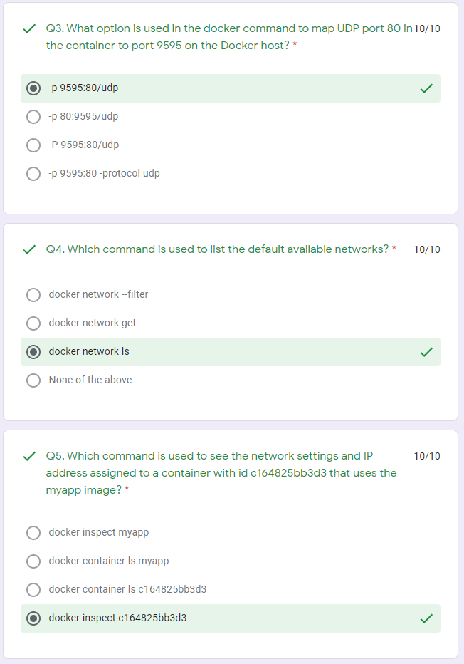


</details>

### Week 14 : 20220106 : Docker Storage

<details>
  <summary>Click to expand!</summary>

#### Lab 1

1.1

```dos
docker volume create data-1
ls -l /var/lib/docker/volumes/
ls -l /var/lib/docker/volumes/data-1/
ls -l /var/lib/docker/volumes/data-1/_data
```

```dos
$ docker volume create data-1
data-1
$ ls -l /var/lib/docker/volumes/
total 32
drwxr-xr-x 3 root root  4096 Jan  5 01:21 d745d14fddee7e8d77c623b1b5e1a10bd3ca8121c4eb17d195b34d38877e6193
drwxr-xr-x 3 root root  4096 Jan  5 01:36 data-1
-rw------- 1 root root 32768 Jan  5 01:36 metadata.db
$ ls -l /var/lib/docker/volumes/data-1/
total 4
drwxr-xr-x 2 root root 4096 Jan  5 01:36 _data
$ ls -l /var/lib/docker/volumes/data-1/_data
total 0
```

1.2

```dos
docker run -itd --name=container-1 --mount source=data-1,target=/data busybox
```

1.3

```dos
docker exec -it container-1 sh
cd /data
echo "Happy 2022" > 20220106.txt
cat /data/20220106.txt
exit
cd /var/lib/docker/volumes/data-1/_data
cat 20220106.txt
```

```dos
$ docker exec -it container-1 sh
/ # cd /data
/data # echo "Happy 2022" > 20220106.txt
/data # cat /data/20220106.txt
Happy 2022
/data # exit
$ cd /var/lib/docker/volumes/data-1/_data
$ cat 20220106.txt
Happy 2022
```

#### Lab 2

2.1

```dos
docker info|grep -i storage
vim /etc/docker/daemon.json
{
  "storage-driver": "aufs"
}


systemctl restart docker
docker info|grep -i storage
```

```dos
$ docker info|grep -i storage
 Storage Driver: overlay
WARNING: No swap limit support
WARNING: the overlay storage-driver is deprecated, and will be removed in a future release.
```

```dos
$ docker info|grep -i storage
WARNING: No swap limit support
WARNING: the aufs storage-driver is deprecated, and will be removed in a future release.
 Storage Driver: aufs
```

2.2

```dos
cd /tmp
mkdir aufs
cd aufs
mkdir mnt image-1 image-2 container-1
echo "This is container-1" > container-1/container1.txt
echo "This is image 1" > image-1/image1.txt
echo "This is image 2" > image-2/image2.txt
tree .
```

```dos
$ tree .
.
├── container-1
│   └── container1.txt
├── image-1
│   └── image1.txt
├── image-2
│   └── image2.txt
└── mnt

4 directories, 3 files
```

2.3

```dos
cd /tmp/aufs
mount -t aufs -o dirs=./container-1:./image-2:./image-1  none  ./mnt
mount -t aufs
cat /sys/fs/aufs/
cat /sys/fs/aufs/si_????/*
ls -l /tmp/aufs/mnt
```

2.4

```dos
ls /tmp/aufs/container-1/
echo "New content" >  /tmp/aufs/mnt/image1.txt
cat /tmp/aufs/image-1/image1.txt
cat /tmp/aufs/container-1/image1.txt
```

#### Lab 3

3.1

```dos
docker info |grep -i storage
sudo systemctl stop docker
sudo cp -au /var/lib/docker  /var/lib/docker.bak

vi /etc/docker/daemon.json
{
  "storage-driver": "overlay2",
  "storage-opts": [
    "overlay2.size=20G",
    "overlay2.override_kernel_check=true"
  ]
}

sudo systemctl start docker

docker info |grep -i storage
```

```dos
vi /etc/docker/daemon.json
{
  "storage-driver": "overlay",
}
```

3.2

```dos
cd /tmp/
mkdir overlay
cd overlay
mkdir -p lower1/a  lower1/b
mkdir -p lower2/a  lower2/c
mkdir -p upper/b  upper/d
mkdir -p work merged
tree /tmp/overlay
mount -t overlay overlay -o lowerdir=lower1:lower2,upperdir=upper,workdir=work merged
tree /tmp/overlay
```

```dos
$ tree /tmp/overlay
/tmp/overlay
├── lower1
│   ├── a
│   └── b
├── lower2
│   ├── a
│   └── c
├── merged
├── upper
│   ├── b
│   └── d
└── work

11 directories, 0 files
$ mount -t overlay overlay -o lowerdir=lower1:lower2,upperdir=upper,workdir=work merged
$ tree /tmp/overlay
/tmp/overlay
├── lower1
│   ├── a
│   └── b
├── lower2
│   ├── a
│   └── c
├── merged
│   ├── a
│   ├── b
│   ├── c
│   └── d
├── upper
│   ├── b
│   └── d
└── work
    └── work
```

3.3

```dos
cd /tmp/overlay/merged/a
echo 'hello' > test
find /tmp/overlay -name test
```

```dos
$ find /tmp/overlay -name test
/tmp/overlay/upper/a/test
/tmp/overlay/merged/a/test
```

3.4

```dos
echo "New content" > /tmp/overlay/merged/b/b.txt
cat /tmp/overlay/upper/b/b.txt
cat /tmp/overlay/lower1/b/b.txt
```

3.5

```dos
tree /tmp/overlay
echo "New content" > /tmp/overlay/merged/c/c.txt
tree /tmp/overlay
cat /tmp/overlay/lower2/c/c.txt
cat /tmp/overlay/upper/c/c.txt
```

#### Questions

https://docs.google.com/forms/d/e/1FAIpQLSeSCgtPxxA_mvGc_P59S5uv3FLTAH4bcTK7g1aN_jlcgkYb-Q/viewform?vc=0&c=0&w=1&flr=0

https://docs.google.com/forms/d/e/1FAIpQLSeSCgtPxxA_mvGc_P59S5uv3FLTAH4bcTK7g1aN_jlcgkYb-Q/viewscore?viewscore=AE0zAgACeFCSvYFvlH0kckst8uIe2CCKAR49dHTYrPx25pjS8rFxKrdmnOvLHpf6PYjQQi8

```dos
$ docker volume --help

Usage:  docker volume COMMAND

Manage volumes

Commands:
  create      Create a volume
  inspect     Display detailed information on one or more volumes
  ls          List volumes
  prune       Remove all unused local volumes
  rm          Remove one or more volumes
```

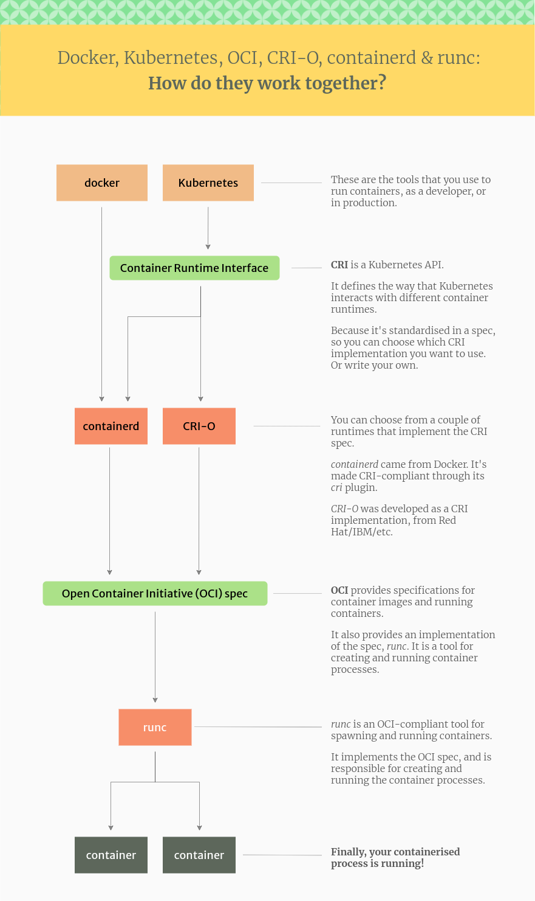

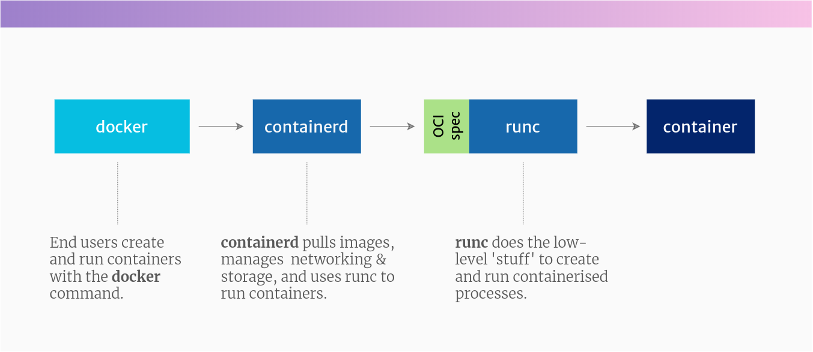

There are three components in the Docker Engine:

- Server: It is the docker daemon called dockerd. It can create and manage docker images. Containers, networks, etc.
- Rest API: It is used to instruct docker daemon what to do.
- Command Line Interface (CLI): It is a client which is used to enter docker commands.

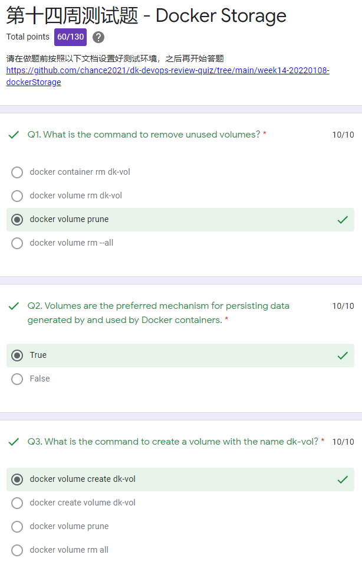

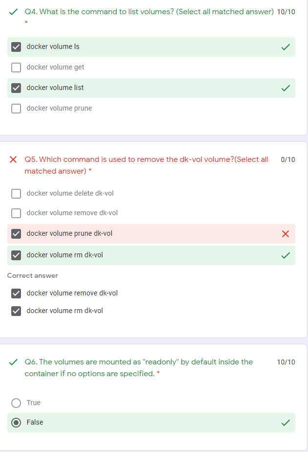


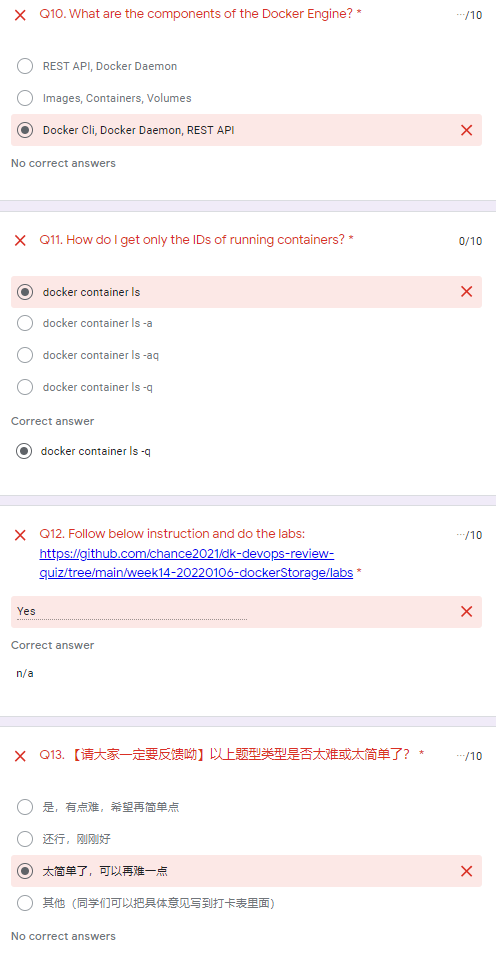

</details>

### Week 15 : 20220113 : Docker Compose

<details>
  <summary>Click to expand!</summary>

#### Lab 1

```dos
cd /tmp
git clone https://github.com/dockersamples/example-voting-app.git
```

```dos
cd /tmp/example-voting-app/vote
docker build -t voting-app .
docker run -d -p 5000:80 --name voting-app voting-app
```

```dos
docker run -d --name=redis redis:alpine

docker network create backend
docker network connect backend redis
docker network connect backend voting-app
```

```dos
docker run -d --name=db -e POSTGRES_USER=postgres -e POSTGRES_PASSWORD=postgres -e PGDATA=/var/lib/postgresql/data/pgdata postgres:9.4
docker network connect backend db
```

```dos
cd /tmp/example-voting-app/worker
docker build -t worker-app .
docker run -d --name worker-app worker-app
docker network connect backend worker-app
```

#### Lab 2

```dos
sudo curl -L "https://github.com/docker/compose/releases/download/1.29.2/docker-compose-$(uname -s)-$(uname -m)" -o /usr/local/bin/docker-compose
sudo chmod +x /usr/local/bin/docker-compose
sudo ln -s /usr/local/bin/docker-compose /usr/bin/docker-compose
docker-compose --version
```

```dos
cd /tmp
git clone https://github.com/dockersamples/example-voting-app.git
```

#### Questions

https://docs.google.com/forms/d/e/1FAIpQLSe1TFbJYaQupH8GI8cza0-cVVlRd-ygkilj5n_AI9NX7FI2iw/viewform?vc=0&c=0&w=1&flr=0

https://docs.google.com/forms/d/e/1FAIpQLSe1TFbJYaQupH8GI8cza0-cVVlRd-ygkilj5n_AI9NX7FI2iw/viewscore?viewscore=AE0zAgAf4-vFqoYunIPF9nYl0x2Kx3yqcqZsSK4xh26aEjYTk6eUf_zDC03V-lrTBas2wKQ

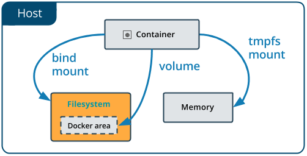


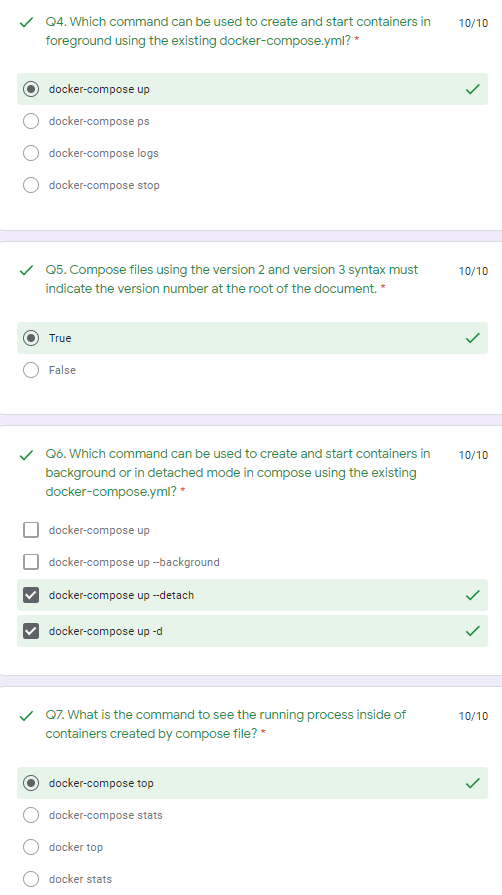

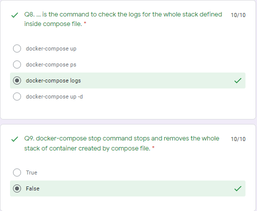

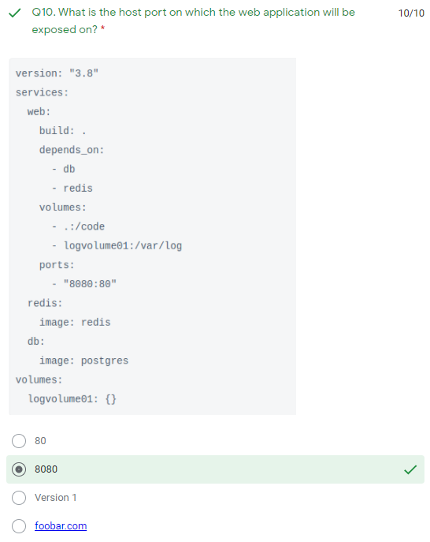

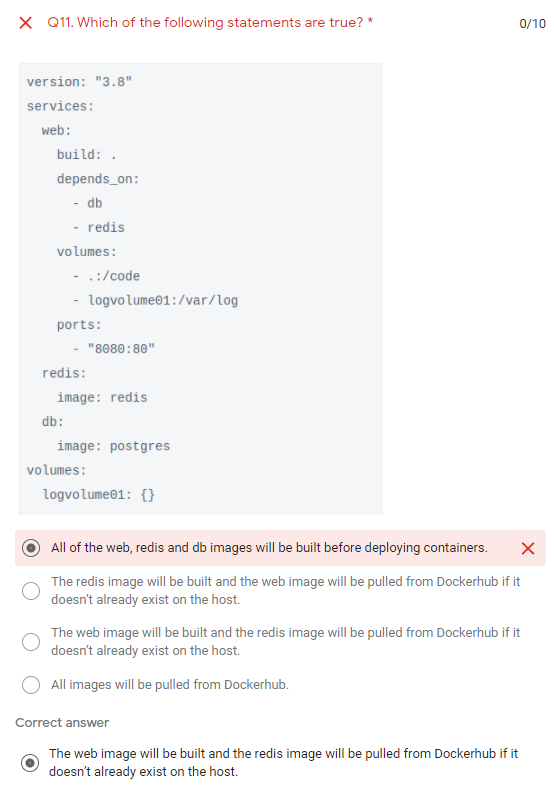

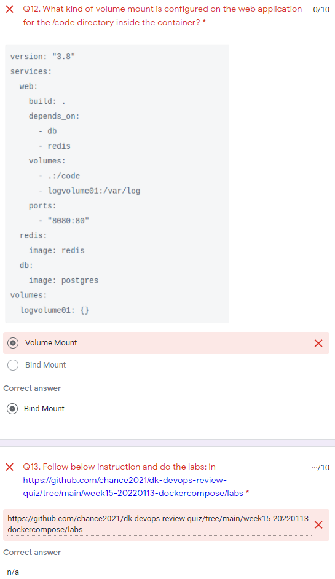


journalctl

Journalctl is a utility for querying and displaying logs from journald, systemd's logging service. Since journald stores log data in a binary format instead of a plaintext format, journalctl is the standard way of reading log messages processed by journald.

Q11

`build: .` means it will be built.

If no `build:`, then will be pulled from Dockerhub.

</details>

### Week 16 : 20220120 : Docker Swarm

<details>
  <summary>Click to expand!</summary>

</details>

```dos
git clone https://github.com/chance2021/dk-devops-review-quiz.git

bash dk-devops-review-quiz/week16-20220120-dockerSwarm/setup.sh
```

#### Lab 1

1. Check the system information of your local environment

```dos
cat /etc/*release*
nproc
free -h
df -h
docker --version
systemctl status docker
docker system info |grep -i swarm
```

Output:

```dos
$ cat /etc/*release*
DISTRIB_ID=Ubuntu
DISTRIB_RELEASE=16.04
DISTRIB_CODENAME=xenial
DISTRIB_DESCRIPTION="Ubuntu 16.04.7 LTS"
NAME="Ubuntu"
VERSION="16.04.7 LTS (Xenial Xerus)"
ID=ubuntu
ID_LIKE=debian
PRETTY_NAME="Ubuntu 16.04.7 LTS"
VERSION_ID="16.04"
HOME_URL="http://www.ubuntu.com/"
SUPPORT_URL="http://help.ubuntu.com/"
BUG_REPORT_URL="http://bugs.launchpad.net/ubuntu/"
VERSION_CODENAME=xenial
UBUNTU_CODENAME=xenial
$ nproc
2
$ free -h
              total        used        free      shared  buff/cache   available
Mem:           1.5G        113M        708M        672K        673M        1.2G
Swap:          3.9G          0B        3.9G
$ df -h
Filesystem      Size  Used Avail Use% Mounted on
udev            729M     0  729M   0% /dev
tmpfs           150M  668K  149M   1% /run
/dev/vda1       237G  7.6G  217G   4% /
tmpfs           748M     0  748M   0% /dev/shm
tmpfs           5.0M     0  5.0M   0% /run/lock
tmpfs           748M     0  748M   0% /sys/fs/cgroup
tmpfs           150M     0  150M   0% /run/user/0
overlay         237G  7.6G  217G   4% /var/lib/docker/overlay/eecf0dd012b13c176e0145876e22850a7562f80254508178e803908e8df5b235/merged
overlay         237G  7.6G  217G   4% /var/lib/docker/overlay/05e35729746ff2d5568b69d24d04712d6b076a031145680ff5c043367916b27b/merged
$ docker --version
Docker version 19.03.13, build 4484c46d9d
$ systemctl status docker
● docker.service - Docker Application Container Engine
   Loaded: loaded (/lib/systemd/system/docker.service; enabled; vendor preset: enabled)
   Active: active (running) since Thu 2022-01-27 15:50:58 UTC; 4min 46s ago
     Docs: https://docs.docker.com
 Main PID: 835 (dockerd)
    Tasks: 33
   Memory: 434.8M
      CPU: 10.655s
   CGroup: /system.slice/docker.service
           ├─ 835 /usr/bin/dockerd -H fd:// --containerd=/run/containerd/containerd.sock
           ├─1375 /usr/bin/docker-proxy -proto tcp -host-ip 0.0.0.0 -host-port 8888 -container-ip 172.18.0.2 -container-port 80
           ├─1390 /usr/bin/docker-proxy -proto tcp -host-ip 0.0.0.0 -host-port 9999 -container-ip 172.18.0.3 -container-port 6379
           └─1406 /usr/bin/docker-proxy -proto tcp -host-ip 0.0.0.0 -host-port 7777 -container-ip 172.18.0.3 -container-port 6378
$ docker system info |grep -i swarm
 Swarm: inactive
WARNING: No swap limit support
WARNING: the overlay storage-driver is deprecated, and will be removed in a future release.
```

2. Initiate a docker swarm cluster

```dos
docker swarm init
docker system info |grep -i swarm
docker node ls
docker node inspect host01 --pretty|more
```

Output:

```dos
$ docker swarm init
Swarm initialized: current node (aff4ecq41u63dvmnq80q7ufkv) is now a manager.

To add a worker to this swarm, run the following command:

    docker swarm join --token SWMTKN-1-1y756y12kdrmp2r5z0tma7qe4d6tkwdfkli01d0v2p7cq1ujdr-8z9u4to10raci8ff5l799jjbs 172.17.0.25:2377

To add a manager to this swarm, run 'docker swarm join-token manager' and follow the instructions.

$ docker system info |grep -i swarm
 Swarm: active
WARNING: No swap limit support
WARNING: the overlay storage-driver is deprecated, and will be removed in a future release.
$ docker node ls
ID                            HOSTNAME            STATUS              AVAILABILITY        MANAGER STATUS      ENGINE VERSION
aff4ecq41u63dvmnq80q7ufkv *   host01              Ready               Active              Leader              19.03.13
$ docker node inspect host01 --pretty|more
ID:                     aff4ecq41u63dvmnq80q7ufkv
Hostname:               host01
Joined at:              2022-01-27 15:58:18.497959782 +0000 utc
Status:
 State:                 Ready
 Availability:          Active
 Address:               172.17.0.25
Manager Status:
 Address:               172.17.0.25:2377
 Raft Status:           Reachable
 Leader:                Yes
Platform:
 Operating System:      linux
 Architecture:          x86_64
Resources:
 CPUs:                  2
 Memory:                1.461GiB
Plugins:
 Log:           awslogs, fluentd, gcplogs, gelf, journald, json-file, local, logentries, splunk, syslog
 Network:               bridge, host, ipvlan, macvlan, null, overlay
 Volume:                local
Engine Version:         19.03.13
TLS Info:
 TrustRoot:
-----BEGIN CERTIFICATE-----
MIIBazCCARCgAwIBAgIUVwiKk57grkcYm63UWJfSs9wJ8lcwCgYIKoZIzj0EAwIw
EzERMA8GA1UEAxMIc3dhcm0tY2EwHhcNMjIwMTI3MTU1MzAwWhcNNDIwMTIyMTU1
MzAwWjATMREwDwYDVQQDEwhzd2FybS1jYTBZMBMGByqGSM49AgEGCCqGSM49AwEH
A0IABB/yd4vW0zVIO+Rru9c1VtR8rPxFT4dh9aZGe6jwxaw/OPqKqdwWmliYacg1
OHfzdKNYX20+yuJ/dHdlZ+sYnMKjQjBAMA4GA1UdDwEB/wQEAwIBBjAPBgNVHRMB
Af8EBTADAQH/MB0GA1UdDgQWBBT09zqDJPjgpNquOjo3fNqBNAPKdzAKBggqhkjO
PQQDAgNJADBGAiEAq5EPwKy1paVKBZso78M/t0ME8bsKASdHDnV0UMZvpsoCIQDM
KJWf8ESWbOeDOEshn/gX+Num644SXUDweqRpO4Gn8w==
-----END CERTIFICATE-----

 Issuer Subject:        MBMxETAPBgNVBAMTCHN3YXJtLWNh
 Issuer Public Key:     MFkwEwYHKoZIzj0CAQYIKoZIzj0DAQcDQgAEH/J3i9bTNUg75Gu71zVW1Hys/EVPh2H1pkZ7qPDFrD84+oqp3BaaWJhpyDU4d/N0o1hfbT7K4n90d2Vn6xicwg==
```

3. Join another manager or worker

```dos
docker swarm join-token manager
docker swarm join-token worker
```

Note: Copy the join command and run in the manager/worker node

Note: Below steps need a second host to be performed

Output:

```dos
$ docker swarm join-token manager
To add a manager to this swarm, run the following command:

    docker swarm join --token SWMTKN-1-1y756y12kdrmp2r5z0tma7qe4d6tkwdfkli01d0v2p7cq1ujdr-aw7uz76itttmhtih6x4lxah0k 172.17.0.25:2377
$ docker swarm join-token worker
To add a worker to this swarm, run the following command:

    docker swarm join --token SWMTKN-1-1y756y12kdrmp2r5z0tma7qe4d6tkwdfkli01d0v2p7cq1ujdr-8z9u4to10raci8ff5l799jjbs 172.17.0.25:2377

$ docker swarm join --token SWMTKN-1-1y756y12kdrmp2r5z0tma7qe4d6tkwdfkli01d0v2p7cq1ujdr-aw7uz76itttmhtih6x4lxah0k 172.17.0.25:2377
Error response from daemon: This node is already part of a swarm. Use "docker swarm leave" to leave this swarm and join another one.
$ docker swarm join --token SWMTKN-1-1y756y12kdrmp2r5z0tma7qe4d6tkwdfkli01d0v2p7cq1ujdr-8z9u4to10raci8ff5l799jjbs 172.17.0.25:2377
Error response from daemon: This node is already part of a swarm. Use "docker swarm leave" to leave this swarm and join another one.
```

4. Promote a worker node to manager

```dos


```

Output:

```dos


```

#### Lab 2

```dos

```

Output:

```dos


```

```dos

```

Output:

```dos


```

```dos

```

Output:

```dos


```

#### Lab 3

```dos

```

Output:

```dos


```

```dos

```

Output:

```dos


```

```dos

```

Output:

```dos


```

#### Questions

##### Question form

https://docs.google.com/forms/d/e/1FAIpQLSc7d2oV6f3xcvi1Lg-EdUeQD6Pa73YB8oW249g0JJnmqNOAUg/viewform?vc=0&c=0&w=1&flr=0

##### Answer

https://docs.google.com/forms/d/e/1FAIpQLSc7d2oV6f3xcvi1Lg-EdUeQD6Pa73YB8oW249g0JJnmqNOAUg/viewscore?viewscore=AE0zAgAphf9llfJkMNsAlV-IR72U6wXHx3rJpdwv3I4Ub2a6ubt8ohxYGCW5ic0ITFBL7-w

##### Knowledge

A swarm consists of multiple Docker hosts which run in swarm mode and act as managers (to manage membership and delegation) and workers (which run swarm services)

The MANAGER STATUS column shows node participation in the Raft consensus:

- No value indicates a worker node that does not participate in swarm management.
- Leader means the node is the primary manager node that makes all swarm management and orchestration decisions for the swarm.
- Reachable means the node is a manager node participating in the Raft consensus quorum. If the leader node becomes unavailable, the node is eligible for election as the new leader.
- Unavailable means the node is a manager that can’t communicate with other managers. If a manager node becomes unavailable, you should either join a new manager node to the swarm or promote a worker node to be a manager.

Docker recommends a maximum of seven manager nodes for a swarm. Important Note: Adding more managers does NOT mean increased scalability or higher performance.

Swarm manager nodes use the Raft Consensus Algorithm to manage the swarm state.

Raft tolerates up to (N-1)/2 failures and requires a majority or quorum of (N/2)+1 members to agree on values proposed to the cluster. This means that in a cluster of 5 Managers running Raft, if 3 nodes are unavailable, the system cannot process any more requests to schedule additional tasks. The existing tasks keep running but the scheduler cannot rebalance tasks to cope with failures if the manager set is not healthy.

Distribute manager nodes

In addition to maintaining an odd number of manager nodes, pay attention to datacenter topology when placing managers. For optimal fault-tolerance, distribute manager nodes across a minimum of 3 availability-zones to support failures of an entire set of machines or common maintenance scenarios. If you suffer a failure in any of those zones, the swarm should maintain the quorum of manager nodes available to process requests and rebalance workloads.

Swarm task states

- Create a service by using docker service create .
- The request goes to a Docker manager node.
- The Docker manager node schedules the service to run on particular nodes.
- Each service can start multiple tasks.
- Each task has a life cycle, with states like NEW , PENDING , and COMPLETE .

```
Swarm manager nodes	    Repartition (on 3 Availability zones)
3	1-1-1
5	2-2-1
7	3-2-2
9	3-3-3
```


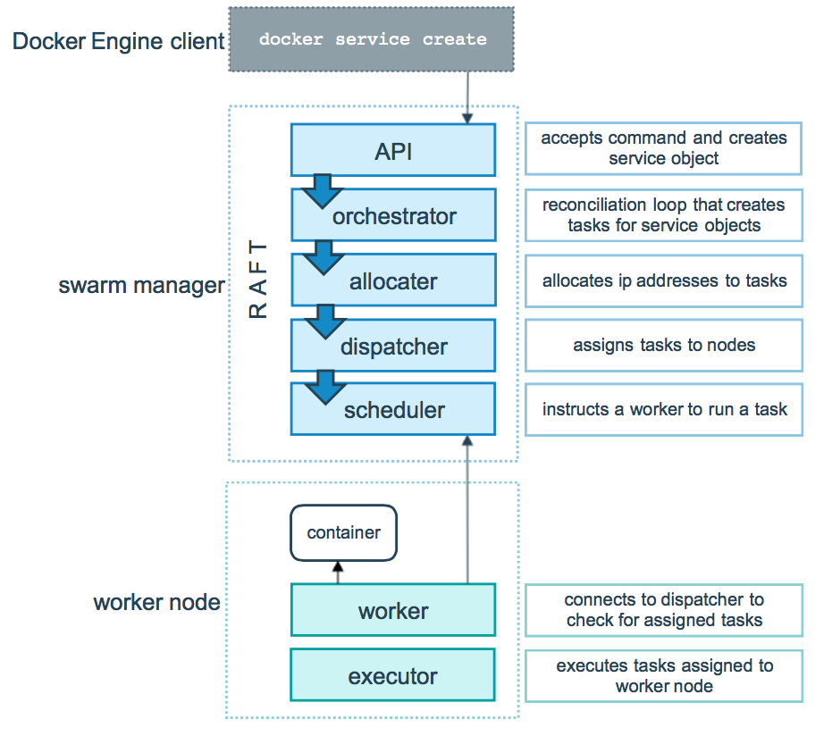

docker service create

https://docs.docker.com/engine/reference/commandline/service_create/

```dos
docker service create --name=webapp -p 8080:80 httpd
docker service create --name=webapp --publish published=8080,target=80 httpd
```

Set service mode (--mode)

The service mode determines whether this is a replicated service or a global service. A replicated service runs as many tasks as specified, while a global service runs on each active node in the swarm.

You need the following ports open to traffic to and from each Docker host participating on an overlay network:

- TCP port 2377 for cluster management communications.
- TCP and UDP port 7946 for communication among nodes. U
- DP port 4789 for overlay network traffic.

To create an overlay network which can be used by swarm services or standalone containers to communicate with other standalone containers running on other Docker daemons, add the --attachable flag:

```dos
docker network create -d overlay --attachable my-attachable-overlay
```

https://www.vegait.rs/media-center/blog/docker-series-docker-swarm-intro#:~:text=Dispatcher%20is%20a%20component%20to,to%20connect%20to%20the%20dispatcher

##### Sreenshot


### Week ?? : ??

<details>
  <summary>Click to expand!</summary>

#### Questions

</details>

## Appendix

<details>
  <summary>Click to expand!</summary>

### 打卡

https://docs.google.com/spreadsheets/d/1ycnDY6OF1UFTYxSq2lWlQo0y-g6Ozko1KRAQysBQOPg/edit#gid=0

- Chance chance.chen21@gmail.com
- Tony taixue@gmail.com
- Liza Lin lizalin09@gmail.com
- 戎 Roger rogerrwh.work@gmail.com
- Ben Li benli888@hotmail.com
- Angie Fang angiefang@yahoo.com
- Eric eyoonltd@gmail.com
- Brian briansu2004@hotmail.com
- Leo liu leoliu20140212@gmail.com
- Bin Yu yubin.on.ca@gmail.com
- ...

### Terraform test

https://docs.google.com/document/d/1pLFx39SwgsrhuCEjRMDnUxQlW3C44MB9bNVH_CzeAv0/edit

</details>
