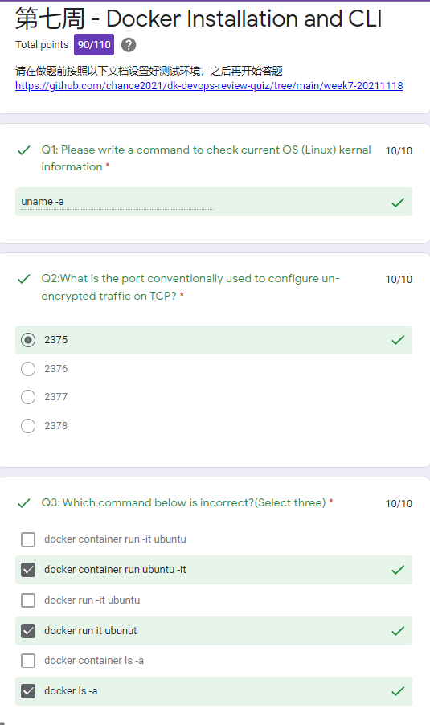
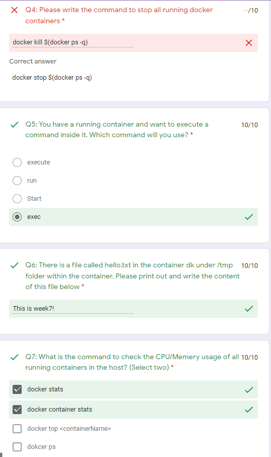
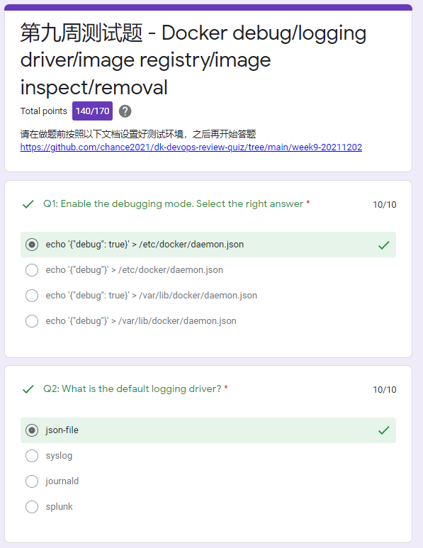
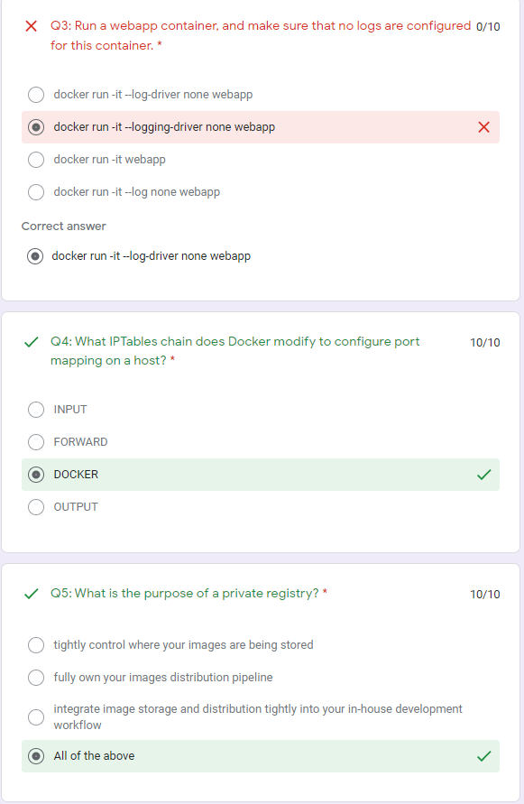
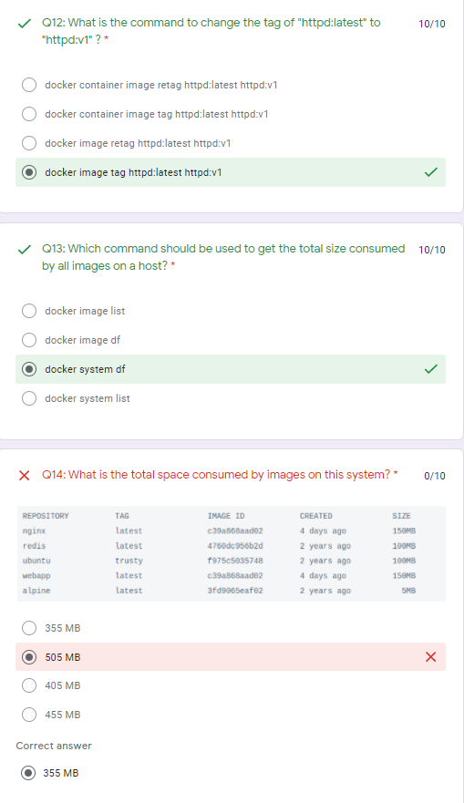
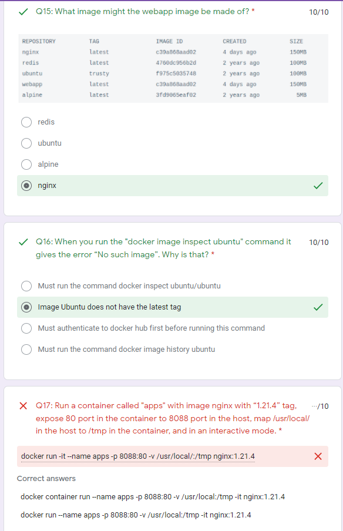
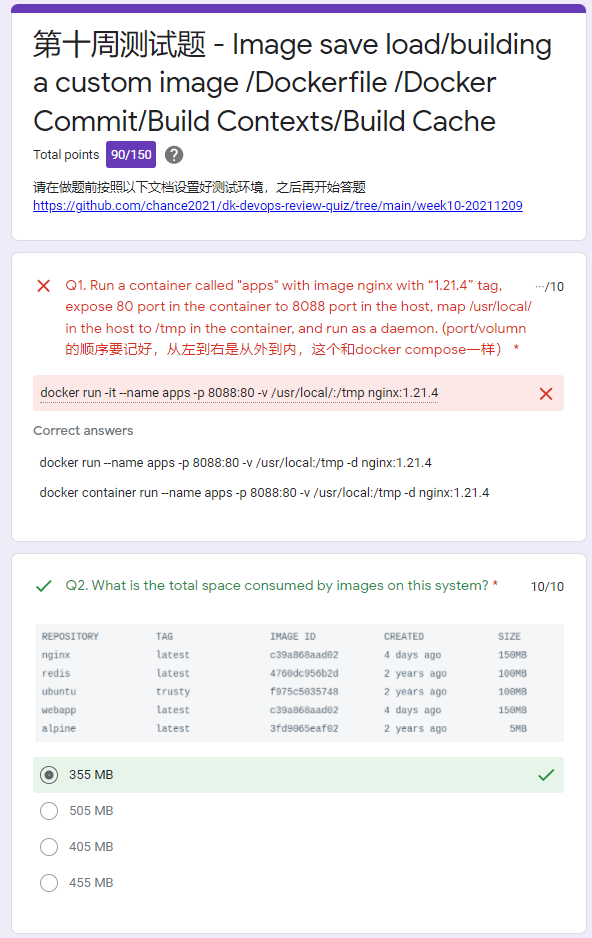

# MyDocker

### Week 5 : 20211104

<details>
  <summary>Click to expand!</summary>

Form

https://docs.google.com/forms/d/e/1FAIpQLSe7askqcK5IQcE8ejKbBlCL7LkDAY_4N3QVm1uJJTfea1J-SQ/viewform?usp=sf_link

```shell
#!/bin/bash

docker pull nginx:1.20
docker pull redis:alpine3.14
docker pull hello-world
docker pull ubuntu
docker run -d --name indoc -p 8080:80 -p 8081:80 nginx:1.20 &
docker run -d --name dk -p 8082:6379 redis:alpine3.14  &
clear
echo "Please wait 10s for the environment setup..."
sleep 10s
echo ""
echo ""
echo "The test environment is ready! Please go to the quiz to start your test! Good luck!"
echo "Note: The quiz link should be sent to your email. Please contact Chance if you don't receive it. Thanks"
```

</details>

### Week 6 : 20211111

<details>
  <summary>Click to expand!</summary>

https://docs.google.com/forms/d/e/1FAIpQLSfwYtUy4sRGcKCLtSniodfM3Epka4leQu3LDv9K1Fg-OFLjQw/viewscore?viewscore=AE0zAgDjCpW4PNJUMEn6ShcOq5DK3d_gXGKiks5hPbCToXVuCWLZ4ExXYvY4DahB5eMyhOw

```shell
$ pwd
/root/dk-devops-review-quiz/week6-20211111
$ cat setup.sh
#!/bin/bash

docker pull nginx
docker pull redis
docker pull hello-world
docker pull ubuntu
docker run -d --name dk -p 8888:80 -v /usr/local/share:/tmp nginx &
docker run -d --name indoc -p 9999:6379 -p 7777:6378 redis &
clear
echo "Please wait 10s for the environment setup..."
sleep 10s
echo ""
echo ""
echo "The test environment is ready! Please go to the quiz to start your test! Good luck!"
echo "Note: The quiz link should be sent to your email. Please contact Chance if you don't receive it. Thanks"
```


</details>

### Week 7 : 20211118

<details>
  <summary>Click to expand!</summary>

https://docs.google.com/forms/d/e/1FAIpQLSdp8j9vBE0ah8Gt4sEUVKp67VwOEhVGCZTcI3Eq4WNxAzioVw/viewform?vc=0&c=0&w=1&flr=0

https://docs.google.com/forms/d/e/1FAIpQLSdp8j9vBE0ah8Gt4sEUVKp67VwOEhVGCZTcI3Eq4WNxAzioVw/viewscore?viewscore=AE0zAgAldjB2mYgCnKPUulcYS81cd0sdoeipA9keGTTZixQ8zo0RIbW-95pQwtZg__M0ly8

```dos
$ pwd
/root/dk-devops-review-quiz/week6-20211111
$ cat setup.sh
#!/bin/bash

docker pull nginx
docker pull redis
docker pull hello-world
docker pull ubuntu
echo "This is week7!" > /usr/local/share/hello.txt
docker run -d --name dk -p 8888:80 -v /usr/local/share:/tmp nginx &
docker run -d --name indoc -p 9999:6379 -p 7777:6378 redis &

clear
echo "Please wait 5s for the environment setup..."
sleep 5s
echo ""
echo ""
echo "The test environment is ready! Please go to the quiz to start your test! Good luck!"
echo "Note: The quiz link should be sent to your email. Please contact Chance if you don't receive it. Thanks"
```






```dos
docker start dk
docker exec -it dk cat /tmp/hello.txt
```

</details>

### Week 8 : 20211125

<details>
  <summary>Click to expand!</summary>

https://docs.google.com/forms/d/e/1FAIpQLSe0L8OxeNb1R1080r6U2rVLhNnYNFHI2l-6IGIKNnEhEvsxoQ/viewform?vc=0&c=0&w=1&flr=0

```dos
$ docker container run --help | grep name
      --domainname string              Container NIS domain name
  -h, --hostname string                Container host name
      --name string                    Assign a name to the container
      --pid string                     PID namespace to use
  -u, --user string                    Username or UID (format: <name|uid>[:<group|gid>])
      --userns string                  User namespace to use
      --uts string                     UTS namespace to use
$ docker container run -d --name nginx --hostname=webapp nginx
07408e9f51de83aff9bc6db7db661be2bc9939339c9e3a1fca264a35858df405
```

- no Do not automatically restart the container. (the default)
- on-failure[:max-retries] Restart the container if it exits due to an error, which manifests as a non-zero exit code. Optionally, limit the number of times the Docker daemon - attempts to restart the container using the :max-retries option.
- always Always restart the container if it stops. If it is manually stopped, it is restarted only when Docker daemon restarts or the container itself is manually restarted. (See - the second bullet listed in restart policy details)
- unless-stopped Similar to always, except that when the container is stopped (manually or otherwise), it is not restarted even after Docker daemon restarts.

```dos
$ docker container inspect dk | grep restart
$ docker container inspect dk | grep RestartPolicy
            "RestartPolicy": {
```

```dos
            "RestartPolicy": {
                "Name": "no",
                "MaximumRetryCount": 0
            },
```

The live restore option helps reduce container downtime due to daemon crashes, planned outages, or upgrades.

There are two ways to enable the live restore setting to keep containers alive when the daemon becomes unavailable. Only do one of the following.

- Add the configuration to the daemon configuration file. On Linux, this defaults to /etc/docker/daemon.json. On Docker Desktop for Mac or Docker Desktop for Windows, select the Docker icon from the task bar, then click Preferences -> Daemon -> Advanced.

  Use the following JSON to enable live-restore.

  ```json
  {
    "live-restore": true
  }
  ```

- Restart the Docker daemon. On Linux, you can avoid a restart (and avoid any downtime for your containers) by reloading the Docker daemon. If you use systemd, then use the command systemctl reload docker. Otherwise, send a SIGHUP signal to the dockerd process.

You can copy files out and then back into a container (even when the container is stopped):

```dos
docker cp $container_name:/path/in/container /path/on/host
```

```dos
docker cp /path/on/host $container_name:/path/in/container
```

```dos
-p 8080:80
Map TCP port 80 in the container to port 8080 on the Docker host.
```

Firewall iptables rules

Use -h option to display size in power of 1024 df -h /home/m

Use -H option to display sizes in power of 1000 df -H /home/m

```dos
$ df
Filesystem     1K-blocks    Used Available Use% Mounted on
udev              745936       0    745936   0% /dev
tmpfs             153172     712    152460   1% /run
/dev/vda1      247794676 8006136 227178236   4% /
tmpfs             765848       0    765848   0% /dev/shm
tmpfs               5120       0      5120   0% /run/lock
tmpfs             765848       0    765848   0% /sys/fs/cgroup
tmpfs             153172       0    153172   0% /run/user/0
overlay        247794676 8006136 227178236   4% /var/lib/docker/overlay/e200940260fed90eb832c4008e6ddf89f4a2dd03570953cea9771414c3cbeee7/merged
overlay        247794676 8006136 227178236   4% /var/lib/docker/overlay/1228229eda137029993387c037298199189cf3163ed4d8dae04a3fcdfcc03237/merged
overlay        247794676 8006136 227178236   4% /var/lib/docker/overlay/427f1061d256696cc5f8c4826face155d72b0b60f5bed486fcf229bd204c5955/merged
$ df -h
Filesystem      Size  Used Avail Use% Mounted on
udev            729M     0  729M   0% /dev
tmpfs           150M  712K  149M   1% /run
/dev/vda1       237G  7.7G  217G   4% /
tmpfs           748M     0  748M   0% /dev/shm
tmpfs           5.0M     0  5.0M   0% /run/lock
tmpfs           748M     0  748M   0% /sys/fs/cgroup
tmpfs           150M     0  150M   0% /run/user/0
overlay         237G  7.7G  217G   4% /var/lib/docker/overlay/e200940260fed90eb832c4008e6ddf89f4a2dd03570953cea9771414c3cbeee7/merged
overlay         237G  7.7G  217G   4% /var/lib/docker/overlay/1228229eda137029993387c037298199189cf3163ed4d8dae04a3fcdfcc03237/merged
overlay         237G  7.7G  217G   4% /var/lib/docker/overlay/427f1061d256696cc5f8c4826face155d72b0b60f5bed486fcf229bd204c5955/merged
$ df -H
Filesystem      Size  Used Avail Use% Mounted on
udev            764M     0  764M   0% /dev
tmpfs           157M  730k  157M   1% /run
/dev/vda1       254G  8.2G  233G   4% /
tmpfs           785M     0  785M   0% /dev/shm
tmpfs           5.3M     0  5.3M   0% /run/lock
tmpfs           785M     0  785M   0% /sys/fs/cgroup
tmpfs           157M     0  157M   0% /run/user/0
overlay         254G  8.2G  233G   4% /var/lib/docker/overlay/e200940260fed90eb832c4008e6ddf89f4a2dd03570953cea9771414c3cbeee7/merged
overlay         254G  8.2G  233G   4% /var/lib/docker/overlay/1228229eda137029993387c037298199189cf3163ed4d8dae04a3fcdfcc03237/merged
overlay         254G  8.2G  233G   4% /var/lib/docker/overlay/427f1061d256696cc5f8c4826face155d72b0b60f5bed486fcf229bd204c5955/merged
```

```dos
$ docker cp dk:/tmp/hello.txt /home
$ ls /home
hello.txt  packer
```

```dos
$ docker exec dk cat /tmp/hello.txt
This is week7!
$ docker exec -it dk echo "This is week9 now" >> /tmp/hello.txt
$ docker exec dk cat /tmp/hello.txt
This is week7!

$ cat /home/hello.txt
This is week7!
$ echo "This is week9 now" >> /home/hello.txt
$ cat /home/hello.txt
This is week7!
This is week9 now

$ docker cp /home/hello.txt dk:/tmp/hello.txt
$ docker exec dk cat /tmp/hello.txt
This is week7!
This is week9 now
```

```dos
docker exec dk bash -c "echo 'This is week9 now' >> /tmp/hello.txt "
docker container exec dk bash -c "echo 'This is week9 now' >> /tmp/hello.txt "
```

-c string If the -c option is present, then commands are read from string.

If there are arguments after the string, they are assigned to the positional parameters, starting with $0.

-v ~/nginxlogs:/var/log/nginx

sets up a bindmount volume that links the /var/log/nginx directory from inside the Nginx container to the ~/nginxlogs directory on the host machine.

Docker uses a : to split the host's path from the container path, and the host path always comes first.

```dos
docker run --name week9 -d -p 8080:80 -v /usr/local/share:/tmp nginx
docker container run --name week9 -d -p 8080:80 -v /usr/local/share:/tmp nginx
```

https://docs.google.com/forms/d/e/1FAIpQLSe0L8OxeNb1R1080r6U2rVLhNnYNFHI2l-6IGIKNnEhEvsxoQ/viewscore?viewscore=AE0zAgAqSi-YcDX_HF_XLDWThAInmx-IvD9HT9YMe4O2ba70Jv4Kc0tsv4bwO0adDMCfcc0


</details>

### Week 9 : 20211202

<details>
  <summary>Click to expand!</summary>

To configure the Docker daemon using a JSON file, create a file at /etc/docker/daemon.json on Linux systems, or C:\ProgramData\docker\config\daemon.json on Windows. On MacOS go to the whale in the taskbar > Preferences > Daemon > Advanced.

Here's what the configuration file looks like:

```
{
  "debug": true,
  "tls": true,
  "tlscert": "/var/docker/server.pem",
  "tlskey": "/var/docker/serverkey.pem",
  "hosts": ["tcp://192.168.59.3:2376"]
}
```

As a default, Docker uses the json-file logging driver, which caches container logs as JSON internally.

The following example starts an Alpine container with the none logging driver.

```dos
docker run -it --log-driver none alpine ash
```

Docker installs two custom iptables chains named DOCKER-USER and DOCKER , and it ensures that incoming packets are always checked by these two chains first.

A private Docker registry allows you to share your custom base images within your organization, keeping a consistent, private, and centralized source of truth for the building blocks of your architecture.

Docker Hub is Docker's official cloud-based registry for Docker images. As you might expect, since Docker Hub is Docker's official registry, it is the default registry when you install Docker.

In reality, latest is used as the default tag when you haven't specified anything else.

Manage images

```dos
docker image
```

```dos
docker image COMMAND
```

List images

```dos
docker image ls
```

The default docker images will show all top level images, their repository and tags, and their size.

List the most recently created images

```dos
docker images
```

List images by name and tag -

```dos
docker images <string>
```

List all images in the "ls" repository

```dos
docker images ls
```

List the full length image IDs

```dos
$ docker images --no-trunc
REPOSITORY                 TAG                 IMAGE ID                                                                  CREATED             SIZE
redis                      latest              sha256:aea9b698d7d1d2fb22fe74868e27e767334b2cc629a8c6f9db8cc1747ba299fd   5 days ago          113MB
nginx                      latest              sha256:f652ca386ed135a4cbe356333e08ef0816f81b2ac8d0619af01e2b256837ed3e   6 days ago          141MB
ubuntu                     latest              sha256:ba6acccedd2923aee4c2acc6a23780b14ed4b8a5fa4e14e252a23b846df9b6c1   7 weeks ago         72.8MB
hello-world                latest              sha256:feb5d9fea6a5e9606aa995e879d862b825965ba48de054caab5ef356dc6b3412   2 months ago        13.3kB
mariadb                    10                  sha256:1b3986d60f138825865a5c22e19d877f0318d60e88383a0e2fb8baa05bd5a461   13 months ago       414MB
mariadb                    latest              sha256:1b3986d60f138825865a5c22e19d877f0318d60e88383a0e2fb8baa05bd5a461   13 months ago       414MB
redis                      <none>              sha256:62f1d3402b787aebcd74aaca5df9d5fe5e8fe4c0706d148a963c70d74a497e51   13 months ago       104MB
ubuntu                     <none>              sha256:d70eaf7277eada08fca944de400e7e4dd97b1262c06ed2b1011500caa4decaf1   13 months ago       72.9MB
mysql                      8                   sha256:db2b37ec6181ee1f367363432f841bf3819d4a9f61d26e42ac16e5bd7ff2ec18   13 months ago       545MB
mysql                      latest              sha256:db2b37ec6181ee1f367363432f841bf3819d4a9f61d26e42ac16e5bd7ff2ec18   13 months ago       545MB
alpine                     latest              sha256:d6e46aa2470df1d32034c6707c8041158b652f38d2a9ae3d7ad7e7532d22ebe0   13 months ago       5.57MB
postgres                   12                  sha256:492fb9ae4e7af4e4aa4169afd0cc8738034f0abd313f231f5f607c067fff4654   14 months ago       314MB
postgres                   latest              sha256:c96f8b6bc0d9f0277f118cf485a8c302e32cfe05e7d65f6e9a4c106679439d5e   14 months ago       314MB
mongo                      latest              sha256:ba0c2ff8d3620c0910832424efef02787214013b1c5b1d9dc9d87d638e2ceb71   14 months ago       492MB
weaveworks/scope           1.11.4              sha256:a082d48f0b3958355182fca79028d369312c10dee0390f1b163b54d9db3e2c33   2 years ago         78.5MB
quay.io/ansible/molecule   2.20                sha256:1171569d6ba4123db651b42a1b28f9735089384f3742977b5f493fe9134cc49a   2 years ago         704MB
```

stars

This example displays images with a name containing ‘busybox’ and at least 3 stars:

```dos
$ docker search --filter stars=3 busybox
NAME                    DESCRIPTION                                     STARS               OFFICIAL            AUTOMATED
busybox                 Busybox base image.                             2415                [OK]
progrium/busybox                                                        70                                      [OK]
radial/busyboxplus      Full-chain, Internet enabled, busybox made f…   43                                      [OK]
yauritux/busybox-curl   Busybox with CURL                               16
arm32v7/busybox         Busybox base image.                             10
armhf/busybox           Busybox base image.                             6
odise/busybox-curl                                                      4                                       [OK]
arm64v8/busybox         Busybox base image.                             3
arm32v6/busybox         Busybox base image.                             3
aarch64/busybox         Busybox base image.                             3
```

```dos
$ docker image ls
REPOSITORY                 TAG                 IMAGE ID            CREATED             SIZE
redis                      latest              aea9b698d7d1        5 days ago          113MB
nginx                      latest              f652ca386ed1        6 days ago          141MB
$ docker image tag redis:latest redis:v1
$ docker image ls
REPOSITORY                 TAG                 IMAGE ID            CREATED             SIZE
redis                      latest              aea9b698d7d1        5 days ago          113MB
redis                      v1                  aea9b698d7d1        5 days ago          113MB
nginx                      latest              f652ca386ed1        6 days ago          141MB
```

Show docker disk usage

```dos
docker system df
```

```dos
$ docker system df
TYPE                TOTAL               ACTIVE              SIZE                RECLAIMABLE
Images              14                  3                   2.971GB             2.842GB (95%)
Containers          3                   2                   1.095kB             0B (0%)
Local Volumes       2                   2                   92B                 0B (0%)
Build Cache         0                   0                   0B                  0B
```

Run a command in a new container

```dos
docker run [OPTIONS] IMAGE [COMMAND] [ARG...]
```

```
--interactive , -i Keep STDIN open even if not attached
--tty , -t Allocate a pseudo-TTY
--name Assign a name to the container
--publish , -p Publish a container's port(s) to the host
--volume , -v Bind mount a volume
```

-p host-port:container-port

-v /host/folder:/container/directory

docker run -it --name apps -p 8088:80 -v /usr/local/:/tmp nginx:1.21.4

https://docs.google.com/forms/d/e/1FAIpQLSdxpyYUfiz7yNgU4gwOSEajESuOQuNqJIuVm0bBjwqoX04meg/viewform?vc=0&c=0&w=1&flr=0

https://docs.google.com/forms/d/e/1FAIpQLSdxpyYUfiz7yNgU4gwOSEajESuOQuNqJIuVm0bBjwqoX04meg/viewscore?viewscore=AE0zAgB97izg5ZY7H1u753KZ8mWHh7Yl0m7-X7PEVOLL5_M3-bUW9LQ-wC4sU23IQwZHw_Y










</details>

### Week 10 : 20211209

<details>
  <summary>Click to expand!</summary>

https://docs.google.com/forms/d/e/1FAIpQLSf784OyJslWcL79G32QRMgofJeyWotnwwDwuOv1l7spLAnHyA/viewform?vc=0&c=0&w=1&flr=0

https://docs.google.com/forms/d/e/1FAIpQLSf784OyJslWcL79G32QRMgofJeyWotnwwDwuOv1l7spLAnHyA/viewscore?viewscore=AE0zAgBT8mUD5F5D1NLRajiF_PvO_LlenlKqD9B5dpE_i2S3N1bXeFhqPlSRBo64lYsTHH0

```dos
$ docker run --name apps -p 8088:80 -v /usr/local:/tmp -d nginx:1.21.4
d81d274f95793d882898054c034c56f4ac7766e2b30702404be0e5e865baab20
```

```dos
$ docker exec dk bash -c "echo 'This is week11 now' > /tmp/week11.txt"
$ docker exec dk bash -c "cat /tmp/week11.txt"
This is week11 now
```

docker commit

Create a new image from a container’s changes

```dos
docker commit [OPTIONS] CONTAINER [REPOSITORY[:TAG]]
```

```dos
$ docker ps
CONTAINER ID        IMAGE               COMMAND                  CREATED             STATUS              PORTS                                            NAMES
5029c0a6807a        nginx               "/docker-entrypoint.…"   11 minutes ago      Up 11 minutes       0.0.0.0:8888->80/tcp                             dk
10ea70f0bee9        redis               "docker-entrypoint.s…"   11 minutes ago      Up 11 minutes       0.0.0.0:7777->6378/tcp, 0.0.0.0:9999->6379/tcp   indoc
$ docker container commit dk mynginx
sha256:46f828c0d24c877a5e39f54a534d0facf7a1be407bc6e75db1393341851826bc
$ docker ps
CONTAINER ID        IMAGE               COMMAND                  CREATED             STATUS              PORTS                                            NAMES
5029c0a6807a        nginx               "/docker-entrypoint.…"   12 minutes ago      Up 12 minutes       0.0.0.0:8888->80/tcp                             dk
10ea70f0bee9        redis               "docker-entrypoint.s…"   12 minutes ago      Up 12 minutes       0.0.0.0:7777->6378/tcp, 0.0.0.0:9999->6379/tcp   indoc
```

docker export

Export a container's filesystem as a tar archive

```dos
 docker export [OPTIONS] CONTAINER
```

```dos
$ docker image list
REPOSITORY                 TAG                 IMAGE ID            CREATED             SIZE
mynginx                    latest              46f828c0d24c        10 minutes ago      141MB
redis                      latest              aea9b698d7d1        12 days ago         113MB
$ docker image save mynginx -o mynginx.tar
$
```

By default, Docker will use /var/lib/docker/tmp for it's temporary directory. This can be overridden with the DOCKER_TMP environment variable for the docker daemon.

Git URLs accept context configuration in their fragment section, separated by a colon (:). The first part represents the reference that Git will check out, and can be either a branch, a tag, or a remote reference. The second part represents a subdirectory inside the repository that will be used as a build context.

For example, run this command to use a directory called docker in the branch container:

```
 docker build https://github.com/docker/rootfs.git#container:docker
```




</details>

## Appendix

<details>
  <summary>Click to expand!</summary>

### 打卡

https://docs.google.com/spreadsheets/d/1ycnDY6OF1UFTYxSq2lWlQo0y-g6Ozko1KRAQysBQOPg/edit#gid=0

- Chance chance.chen21@gmail.com
- Tony taixue@gmail.com
- Liza Lin lizalin09@gmail.com
- 戎 Roger rogerrwh.work@gmail.com
- Ben Li benli888@hotmail.com
- Angie Fang angiefang@yahoo.com
- Eric eyoonltd@gmail.com
- Brian briansu2004@hotmail.com
- Leo liu leoliu20140212@gmail.com
- Bin Yu yubin.on.ca@gmail.com
- ...

</details>
